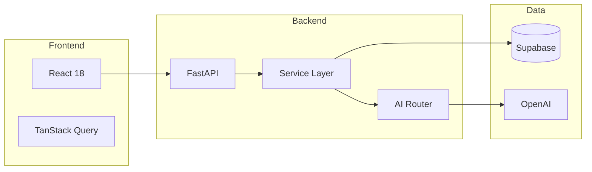

# 📚 SalesFlow AI Documentation

Willkommen zur offiziellen Dokumentation von **SalesFlow AI** – dem intelligenten Sales CRM mit AI-Autopilot.

---

## 🗂️ Dokumentation Übersicht

### Für Developer

| Dokument | Beschreibung |
|----------|--------------|
| [🏗️ Architecture](./developer/architecture.md) | System-Architektur, Datenfluss, Layer |
| [📊 Database Schema](./developer/database-schema.md) | ERD, Tabellen, Enums, RLS |
| [🚀 Local Setup](./developer/setup.md) | Installation, Environment, IDE |

### Für User

| Dokument | Beschreibung |
|----------|--------------|
| [📋 Lead Management](./user-guide/features/leads.md) | Leads erstellen, bearbeiten, Status |
| [🤖 AI Autopilot](./user-guide/features/autopilot.md) | AI-Vorschläge, Review Queue, Kanäle |

---

## 🚀 Quick Start

### Für Developer

```bash
# Clone & Install
git clone https://github.com/your-org/salesflow-ai.git
cd salesflow-ai

# Backend
cd backend && pip install -r requirements.txt
uvicorn app.main:app --reload

# Frontend
npm install && npm run dev
```

👉 Ausführliche Anleitung: [Local Setup](./developer/setup.md)

### Für User

1. Öffnen Sie [app.salesflow.ai](https://app.salesflow.ai)
2. Loggen Sie sich ein oder erstellen Sie ein Konto
3. Erstellen Sie Ihren ersten Lead
4. Aktivieren Sie den Autopilot

---

## 📊 Architektur auf einen Blick



---

## 🔑 Key Features

| Feature | Status | Beschreibung |
|---------|--------|--------------|
| ✅ Lead Management | Live | CRUD, Status, Scoring |
| ✅ AI Autopilot | Live | E-Mail-Drafts, Recommendations |
| ✅ Multi-Model AI | Live | GPT-4o, Claude 3.5, Fallbacks |
| ✅ Security | Live | JWT, Rate Limiting, Encryption |
| 🚧 Analytics Dashboard | Beta | Charts, KPIs, Export |
| 📅 Mobile App | Planned | iOS/Android |

---

## 🛠️ Tech Stack

### Backend
- **Framework:** FastAPI (Python 3.10+)
- **Database:** Supabase (PostgreSQL)
- **AI:** OpenAI GPT-4o, Anthropic Claude 3.5
- **Auth:** JWT + Refresh Token Rotation
- **Security:** bcrypt, Fernet Encryption, Rate Limiting

### Frontend
- **Framework:** React 18 + Vite
- **State:** TanStack Query (React Query)
- **Styling:** TailwindCSS
- **Forms:** React Hook Form + Zod

---

## 📞 Support

- **Email:** support@alsales.ai
- **Discord:** [Join Community](https://discord.gg/salesflow)
- **GitHub Issues:** [Report Bug](https://github.com/your-org/salesflow-ai/issues)

---

## 📄 License

SalesFlow AI is proprietary software. See [LICENSE](../LICENSE) for details.

---

*Last updated: December 2024*
