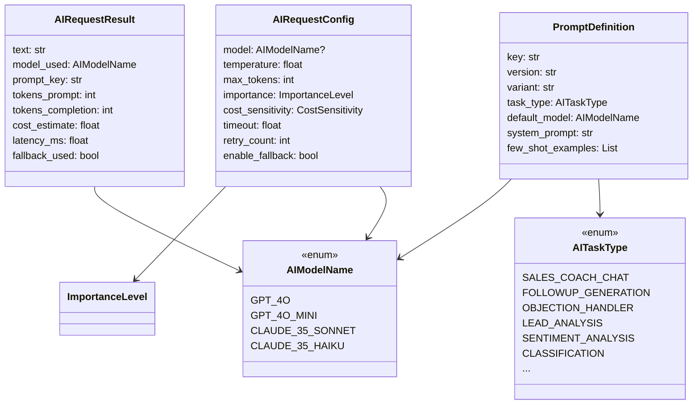
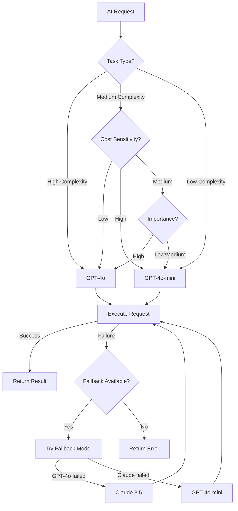
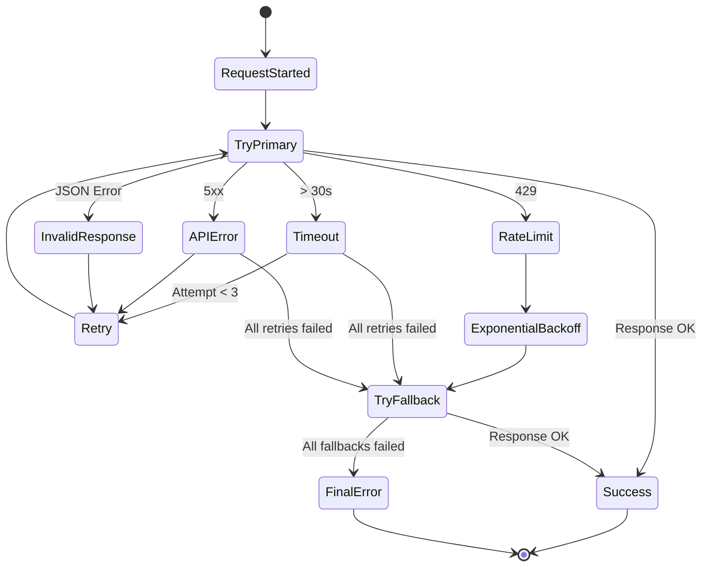
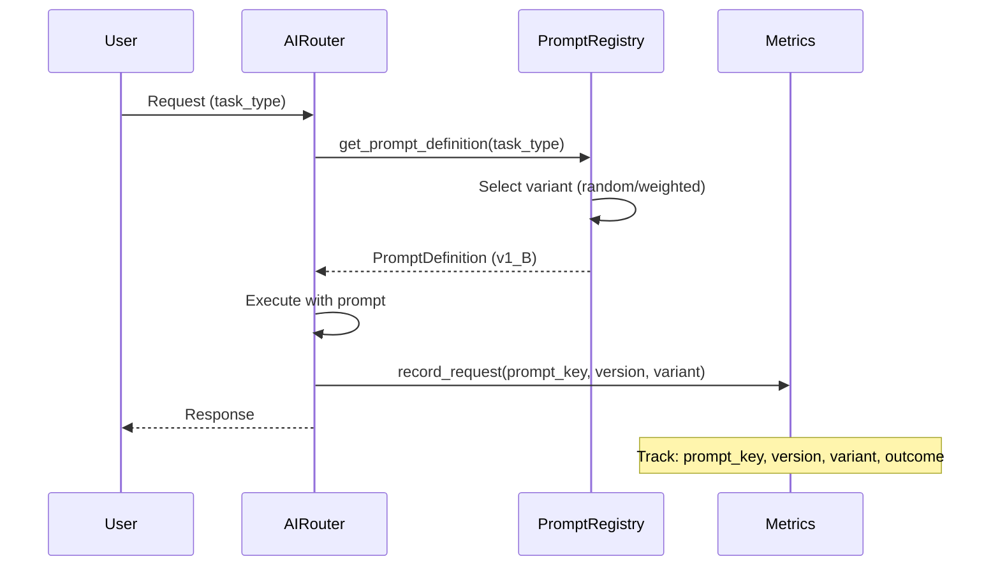

# 🤖 AI Integration Architecture

**System Design Document für SalesFlow AI**

Stand: Dezember 2024

---

## 1. Summary

- **Multi-Model Support**: GPT-4o (Primary), Claude 3.5 (Fallback), GPT-4o-mini (Cost-Layer)
- **Smart Routing**: Task-basierte Modellauswahl mit automatischen Fallbacks
- **Error Handling**: Retry mit Exponential Backoff, Graceful Degradation
- **Prompt Versioning**: A/B-Testing fähig mit Few-Shot Learning Support
- **Monitoring**: Token Usage, Cost Tracking, Latenz-Metriken (p50/p95/p99)

---

## 2. System Design

### 2.1 Aktueller Stand & Probleme

**Stärken der aktuellen Struktur:**
- Zentrale Prompt-Verwaltung in `ai_prompts.py`
- Intent Detection (`detect_action_from_text`)
- Modulare Action-Instructions
- CHIEF vs SALES_COACH Trennung

**Schwächen (behoben):**
- ❌ ~~Modell war hart verdrahtet~~ → ✅ AIRouter mit dynamischer Auswahl
- ❌ ~~Keine Versionierung~~ → ✅ PromptDefinition mit version/variant
- ❌ ~~Kein Fallback-Handling~~ → ✅ Fallback-Kaskaden implementiert
- ❌ ~~Kein Cost-Tracking~~ → ✅ AIMetricsCollector

### 2.2 Domain-Modell & Kernstrukturen



### 2.3 Smart Routing & Modell-Policies



**Task → Modell Mapping:**

| Task Type | Default Model | Fallback Chain |
|-----------|---------------|----------------|
| SALES_COACH_CHAT | GPT-4o | Claude 3.5 → Mini |
| OBJECTION_HANDLER | GPT-4o | Claude 3.5 → Mini |
| CLOSING_HELPER | GPT-4o | Claude 3.5 → Mini |
| LEAD_ANALYSIS | GPT-4o | Claude 3.5 → Mini |
| FOLLOWUP_GENERATION | GPT-4o | Claude 3.5 → Mini |
| SENTIMENT_ANALYSIS | GPT-4o-mini | Claude Haiku |
| CLASSIFICATION | GPT-4o-mini | Claude Haiku |
| GENERATE_MESSAGE | GPT-4o-mini | Claude Haiku |
| DAILY_PLAN | GPT-4o-mini | Claude Haiku |

### 2.4 Error Handling & Fallback-Strategien



**Retry-Strategie:**
- **Retry Count**: 3 pro Modell
- **Backoff**: Exponentiell (0.5s → 1s → 2s)
- **Timeout**: 30s default (konfigurierbar)

**Logging bei Fehlern:**
```python
{
    "event": "ai_request_failed",
    "request_id": "uuid",
    "task_type": "sales_coach_chat",
    "model": "gpt-4o",
    "error_type": "timeout",
    "error_message": "Request timed out after 30s",
    "retry_count": 3,
    "fallback_attempted": true
}
```

### 2.5 Prompt-Optimierung & A/B Testing

**Prompt-Versionierung:**

```
sales_coach_chat_v1_A    # Control
sales_coach_chat_v1_B    # Variant B (z.B. kürzere Antworten)
sales_coach_chat_v2_A    # Neue Version
```

**A/B-Test Flow:**



**Tracking-Felder für A/B-Tests:**
- `prompt_key`: z.B. "sales_coach_chat"
- `version`: z.B. "v1"
- `variant`: z.B. "A" oder "B"
- `outcome`: z.B. "reply_received", "conversion", "user_rating"

**Few-Shot Learning:**
```python
PromptDefinition(
    key="objection_handler",
    few_shot_examples=[
        {
            "input": "Einwand: Das ist mir zu teuer",
            "output": "SOFT: Verstehe ich...\nDIREKT: Zu teuer verglichen womit?..."
        }
    ]
)
```

### 2.6 Monitoring & Metriken

**Events die geloggt werden:**

| Event | Trigger | Daten |
|-------|---------|-------|
| `ai_request_started` | Request beginnt | request_id, task_type, model |
| `ai_request_succeeded` | Erfolg | + latency_ms, tokens, cost |
| `ai_request_failed` | Fehler | + error_type, error_message |
| `ai_request_fallback_used` | Fallback | + original_model, fallback_model |
| `ai_rate_limit_hit` | 429 Response | + wait_time |

**Metriken:**

| Metrik | Aggregation | Dashboard |
|--------|-------------|-----------|
| Token Usage | Sum per model/task | Area Chart |
| Cost (USD) | Sum per model/task | Stacked Bar |
| Latency | p50/p95/p99 | Line Chart |
| Error Rate | Percentage | Gauge |
| Fallback Rate | Percentage | Gauge |
| Success Rate | Percentage | KPI Card |

---

## 3. Python-Implementierung

### 3.1 Typen & Enums (`ai_types.py`)

```python
from enum import Enum
from typing import Literal, TypedDict, Optional, Dict, Any, List

class AIModelName(str, Enum):
    GPT_4O = "gpt-4o"
    GPT_4O_MINI = "gpt-4o-mini"
    CLAUDE_35_SONNET = "claude-3-5-sonnet-20241022"
    CLAUDE_35_HAIKU = "claude-3-5-haiku-20241022"

class AITaskType(str, Enum):
    SALES_COACH_CHAT = "sales_coach_chat"
    FOLLOWUP_GENERATION = "followup_generation"
    OBJECTION_HANDLER = "objection_handler"
    SENTIMENT_ANALYSIS = "sentiment_analysis"
    CLASSIFICATION = "classification"
    # ...

class ImportanceLevel(str, Enum):
    LOW = "low"      # Mini reicht
    MEDIUM = "medium"  # 4o empfohlen
    HIGH = "high"    # 4o zwingend

class CostSensitivity(str, Enum):
    LOW = "low"      # Qualität > Kosten
    MEDIUM = "medium"
    HIGH = "high"    # Kosten > Qualität

class AIRequestConfig(TypedDict, total=False):
    model: Optional[AIModelName]
    temperature: float
    max_tokens: int
    importance: ImportanceLevel
    cost_sensitivity: CostSensitivity
    timeout: float
    retry_count: int
    enable_fallback: bool
```

### 3.2 AI Router (`ai_router.py`)

```python
class AIRouter:
    def __init__(self, client_manager: AIClientManager):
        self.client_manager = client_manager
    
    async def generate(
        self,
        system_prompt: str,
        messages: List[Dict[str, str]],
        task_type: AITaskType,
        config: Optional[AIRequestConfig] = None,
    ) -> AIRequestResult:
        # 1. Modell auswählen
        primary_model = select_model(task_type, importance, cost_sensitivity)
        fallback_models = get_fallback_models(primary_model)
        
        # 2. Request mit Fallback ausführen
        for model in [primary_model] + fallback_models:
            for attempt in range(retry_count):
                try:
                    result = await self._execute_request(model, ...)
                    return result
                except (TimeoutError, RateLimitError):
                    await asyncio.sleep(0.5 * (2 ** attempt))
        
        raise RuntimeError("All models failed")
```

### 3.3 Prompt-Definition & Versionierung (`ai_prompts.py`)

```python
@dataclass
class PromptDefinition:
    key: str
    version: str
    variant: str
    task_type: AITaskType
    default_model: AIModelName
    system_prompt: str
    few_shot_examples: List[Dict[str, str]] = field(default_factory=list)

PROMPT_REGISTRY: Dict[str, PromptDefinition] = {
    "sales_coach_chat_v1_A": PromptDefinition(
        key="sales_coach_chat",
        version="v1",
        variant="A",
        task_type=AITaskType.SALES_COACH_CHAT,
        default_model=AIModelName.GPT_4O,
        system_prompt=SALES_COACH_PROMPT,
    ),
    # ...
}

def get_prompt_definition(task_type: AITaskType, version="v1", variant="A"):
    # Lookup in Registry with fallback
    ...
```

### 3.4 Metrics & Logging (`ai_metrics.py`)

```python
class AIMetricsCollector:
    def record_request_success(
        self,
        request_id: str,
        task_type: AITaskType,
        model_used: AIModelName,
        latency_ms: float,
        tokens_prompt: int,
        tokens_completion: int,
        fallback_used: bool = False,
    ) -> AIRequestMetric:
        cost = self._calculate_cost(model_used, tokens_prompt, tokens_completion)
        # Store metric, update counters
        ...
    
    def get_aggregated_metrics(
        self,
        period_start: datetime,
        period_end: datetime,
    ) -> AggregatedMetrics:
        # Calculate p50/p95/p99 latency, sum tokens, cost
        ...
    
    def get_ab_test_metrics(self, prompt_key: str) -> Dict[str, Dict]:
        # Group by variant, calculate success rates
        ...
```

---

## 4. Monitoring Dashboard Spec

### 4.1 KPIs & Charts

**Sektion 1: AI Usage & Cost**

| Widget | Typ | Daten |
|--------|-----|-------|
| Total Requests (24h) | KPI Card | `count(requests)` |
| Total Cost (24h) | KPI Card | `sum(cost_usd)` |
| Tokens by Model | Stacked Area | `sum(tokens) group by model` |
| Cost by Feature | Donut Chart | `sum(cost) group by task_type` |

**Sektion 2: AI Performance**

| Widget | Typ | Daten |
|--------|-----|-------|
| Latency (p50/p95/p99) | Line Chart | `percentile(latency_ms)` |
| Success Rate | Gauge | `successful / total * 100` |
| Error Rate | Gauge | `failed / total * 100` |
| Fallback Rate | Gauge | `fallback_used / total * 100` |
| Errors by Type | Bar Chart | `count group by error_type` |

**Sektion 3: AI Quality**

| Widget | Typ | Daten |
|--------|-----|-------|
| A/B Test Performance | Table | `variant, requests, success_rate` |
| Model Comparison | Grouped Bar | `model, latency, cost, success_rate` |
| Top Error Messages | Table | `error_message, count` |

### 4.2 Datenquellen & Events

**Event Stream:**
```
ai_request_started → ai_request_succeeded | ai_request_failed
                  → ai_request_fallback_used (optional)
```

**Aggregation:**
- **Real-Time**: In-Memory (AIMetricsCollector)
- **Historical**: PostgreSQL Table + Materialized Views
- **Production**: TimescaleDB oder InfluxDB empfohlen

**Table Schema:**
```sql
CREATE TABLE ai_request_logs (
    id UUID PRIMARY KEY,
    timestamp TIMESTAMPTZ NOT NULL DEFAULT NOW(),
    request_id TEXT NOT NULL,
    task_type TEXT NOT NULL,
    model_requested TEXT NOT NULL,
    model_used TEXT NOT NULL,
    success BOOLEAN NOT NULL,
    latency_ms FLOAT,
    tokens_prompt INT,
    tokens_completion INT,
    cost_usd DECIMAL(10, 6),
    fallback_used BOOLEAN DEFAULT FALSE,
    retry_count INT DEFAULT 0,
    error_type TEXT,
    error_message TEXT,
    prompt_key TEXT,
    prompt_version TEXT,
    prompt_variant TEXT,
    user_id UUID,
    workspace_id UUID
);

CREATE INDEX idx_ai_logs_timestamp ON ai_request_logs(timestamp DESC);
CREATE INDEX idx_ai_logs_task ON ai_request_logs(task_type);
CREATE INDEX idx_ai_logs_model ON ai_request_logs(model_used);
```

---

## 5. Annahmen & Trade-offs

### Annahmen

1. **API-Keys**: OpenAI und Anthropic Keys werden über Environment Variables geladen
2. **Async**: Alle AI-Calls sind async für bessere Concurrency
3. **Caching**: Kein Response-Caching (jeder Request ist unique)
4. **Rate Limits**: OpenAI Tier-2+, Anthropic Standard

### Trade-offs

| Entscheidung | Pro | Contra |
|--------------|-----|--------|
| In-Memory Metrics | Schnell, einfach | Verlust bei Restart |
| Fallback zu Mini | Immer eine Antwort | Qualitätsverlust |
| 3 Retries | Resilient | Höhere Latenz bei Fehlern |

### Erweiterungspunkte

1. **Streaming**: SSE für lange Antworten
2. **Caching**: Redis für wiederholte Anfragen
3. **A/B-Test Manager**: UI für Experiment-Konfiguration
4. **Custom Models**: Fine-tuned Models einbinden
5. **Cost Alerts**: Benachrichtigung bei Budget-Überschreitung

---

## 6. File Structure

```
backend/app/core/
├── ai_types.py      # Enums, TypedDicts
├── ai_policies.py   # Routing-Regeln, Fallback-Kaskaden
├── ai_clients.py    # OpenAI, Anthropic Client Wrapper
├── ai_router.py     # Zentraler Entry-Point
├── ai_metrics.py    # Metrics Collection & Aggregation
└── ai_prompts.py    # Prompt Registry & Versioning
```

---

*Generiert von Claude Opus 4.5 für SalesFlow AI*

