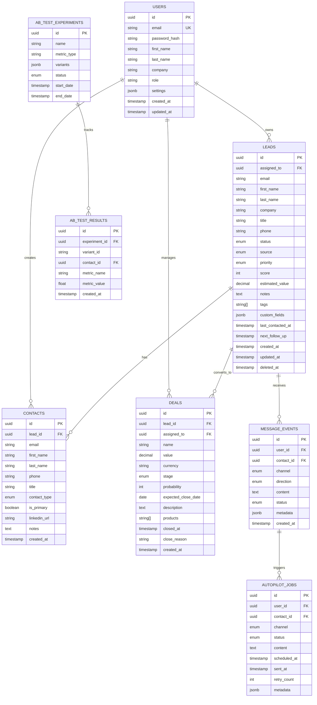
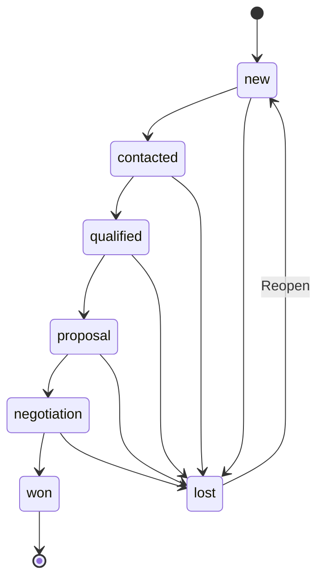
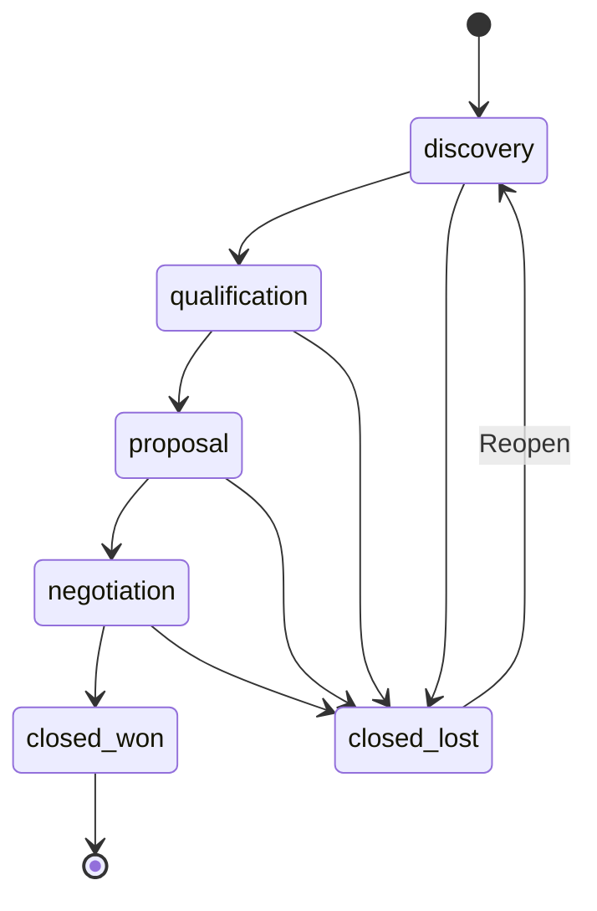

# 📊 Database Schema

SalesFlow AI nutzt **Supabase (PostgreSQL)** mit Row-Level Security (RLS).

---

## Entity Relationship Diagram



---

## Core Tables

### `users`
Benutzerkonten mit Authentifizierung.

| Column | Type | Description |
|--------|------|-------------|
| id | UUID | Primary Key |
| email | VARCHAR(255) | Unique, Login |
| password_hash | TEXT | bcrypt Hash |
| role | ENUM | admin, manager, user, viewer |
| settings | JSONB | User Preferences |

### `leads`
Potenzielle Kunden (Prospects).

| Column | Type | Description |
|--------|------|-------------|
| id | UUID | Primary Key |
| assigned_to | UUID | FK → users.id |
| status | ENUM | new, contacted, qualified, proposal, negotiation, won, lost |
| source | ENUM | website, referral, linkedin, cold_outreach, etc. |
| priority | ENUM | low, medium, high, urgent |
| score | INT | 0-100, AI-berechnet |

### `deals`
Verkaufschancen (Opportunities).

| Column | Type | Description |
|--------|------|-------------|
| id | UUID | Primary Key |
| lead_id | UUID | FK → leads.id |
| stage | ENUM | discovery, qualification, proposal, negotiation, closed_won, closed_lost |
| value | DECIMAL | Deal-Wert in Währung |
| probability | INT | 0-100%, automatisch nach Stage |

---

## Status Enums

### Lead Status Flow



### Deal Stage Flow



---

## Row-Level Security (RLS)

```sql
-- Users can only see their own leads (unless admin/manager)
CREATE POLICY leads_user_access ON leads
    FOR ALL
    USING (
        assigned_to = auth.uid()
        OR auth.jwt()->>'role' IN ('admin', 'manager')
    );

-- Users can only modify their own data
CREATE POLICY leads_user_modify ON leads
    FOR UPDATE
    USING (assigned_to = auth.uid())
    WITH CHECK (assigned_to = auth.uid());
```

---

## Indexes

```sql
-- Performance-kritische Indexes
CREATE INDEX idx_leads_assigned_to ON leads(assigned_to);
CREATE INDEX idx_leads_status ON leads(status);
CREATE INDEX idx_leads_created_at ON leads(created_at DESC);
CREATE INDEX idx_leads_score ON leads(score DESC);

CREATE INDEX idx_deals_lead_id ON deals(lead_id);
CREATE INDEX idx_deals_stage ON deals(stage);
CREATE INDEX idx_deals_value ON deals(value DESC);

CREATE INDEX idx_contacts_lead_id ON contacts(lead_id);
CREATE INDEX idx_contacts_email ON contacts(email);
```

---

## Migrations

Alle Migrationen befinden sich in `backend/migrations/`:

| File | Description |
|------|-------------|
| `20250105_create_users_table.sql` | Users + Token Blacklist |
| `20250106_autopilot_v2_tables.sql` | Autopilot Jobs, A/B Tests |
| `step4_extend_contacts.sql` | Contact Extensions |

---

## Next Steps

- [Architecture Overview](./architecture.md)
- [API Reference](./api-reference.md)
