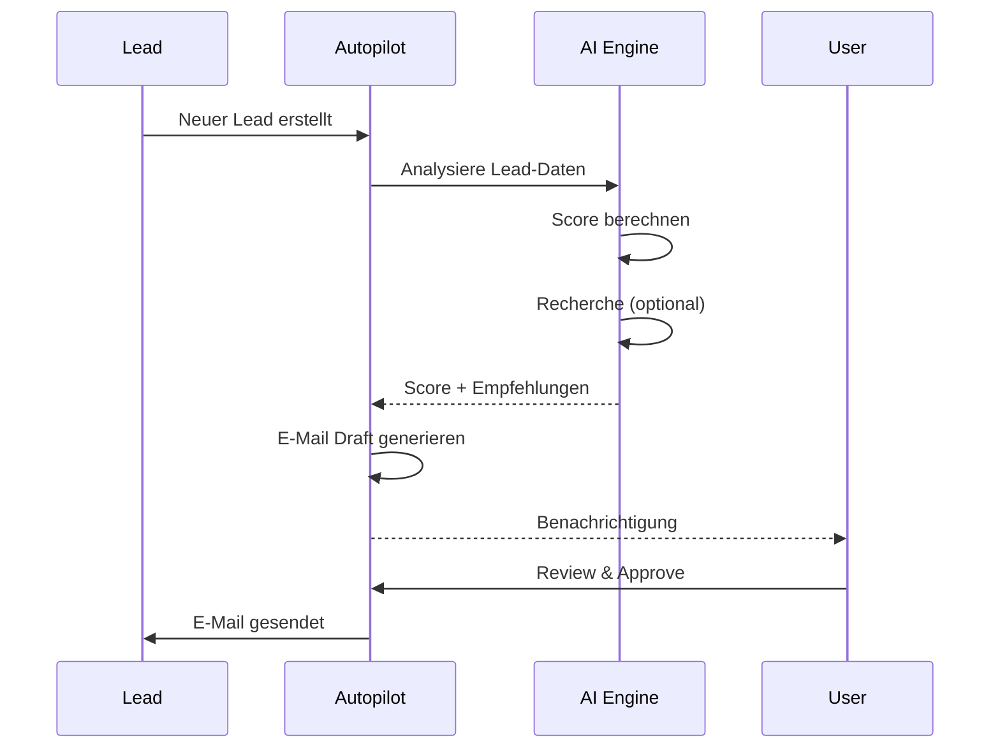
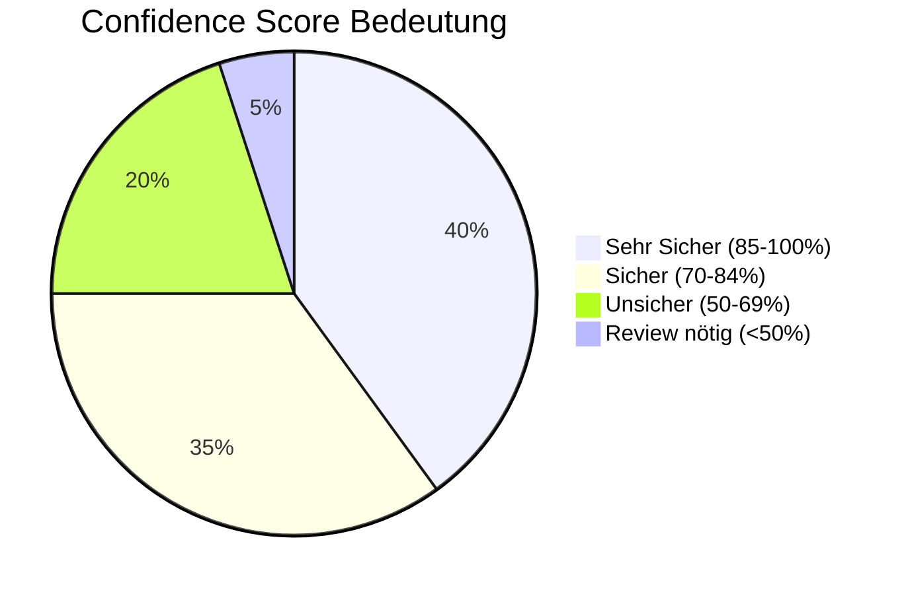
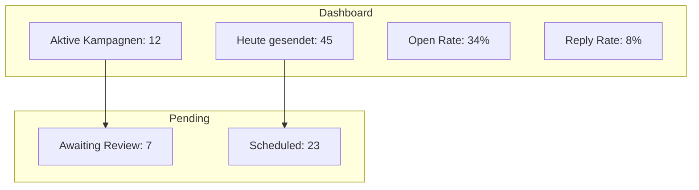

# 🤖 AI Autopilot

Der Autopilot analysiert Ihre Leads und schlägt automatisch nächste Schritte vor – powered by GPT-4o und Claude 3.5.

---

## Wie der Autopilot arbeitet

### Die 3 Schritte

| Step | Was passiert | Dauer |
|------|--------------|-------|
| 1️⃣ **Analyse** | KI scannt Firmendaten, LinkedIn, Website | ~5 Sek |
| 2️⃣ **Scoring** | Lead erhält Score (0-100) basierend auf Potenzial | instant |
| 3️⃣ **Suggestion** | KI generiert personalisierten E-Mail-Entwurf | ~3 Sek |

---

## Autopilot aktivieren

1. Gehen Sie zu **Einstellungen** → **Autopilot**
2. Aktivieren Sie den Schalter "Autopilot aktiv"
3. Wählen Sie Ihre Präferenzen:

> **📸 Screenshot Anweisung:**
> - Screenshot der Autopilot-Einstellungen
> - Zeige: Toggle-Schalter, Dropdown für "Aggressivität"
> - Caption: *"Autopilot-Konfiguration"*

### Konfigurations-Optionen

| Option | Beschreibung | Empfehlung |
|--------|--------------|------------|
| **Aktiviert** | An/Aus | An für aktive Seller |
| **Aggressivität** | Konservativ / Balanced / Aggressiv | Balanced |
| **Auto-Send** | Ohne Review senden | ⚠️ Nur für erfahrene Nutzer |
| **Kanäle** | E-Mail, LinkedIn, WhatsApp | Mindestens E-Mail |

---

## AI-generierte Vorschläge

Wenn der Autopilot einen Vorschlag hat, sehen Sie:

> **📸 Screenshot Anweisung:**
> - Screenshot eines offenen Leads, Fokus auf "Autopilot Sidebar"
> - Visual: Zeige die generierte E-Mail-Draft Box
> - Annotation: Kreise den "Approve & Send" Button ein
> - Caption: *"Der Autopilot schlägt eine personalisierte Intro-Email vor"*

### Vorschlag-Typen

| Typ | Icon | Beschreibung |
|-----|------|--------------|
| 📧 **E-Mail Draft** | ✉️ | Personalisierter E-Mail-Entwurf |
| 📞 **Call Reminder** | 📱 | Erinnerung zum Anruf mit Talking Points |
| 🔗 **LinkedIn Action** | 💼 | Connection Request oder Nachricht |
| 📅 **Meeting Vorschlag** | 📆 | Optimaler Termin basierend auf Engagement |

---

## Confidence Score

Jeder Vorschlag hat einen **Confidence Score**:

| Score | Bedeutung | Was tun? |
|-------|-----------|----------|
| 🟢 85-100% | Sehr sicher | Auto-Send möglich |
| 🟡 70-84% | Sicher | Kurzer Review empfohlen |
| 🟠 50-69% | Unsicher | Manuell prüfen |
| 🔴 <50% | Review nötig | Immer manuell prüfen! |

---

## Vorschlag bearbeiten

Sie können jeden Vorschlag anpassen:

1. Klicken Sie auf **"Bearbeiten"** im Vorschlag
2. Passen Sie Text, Betreff oder Timing an
3. Klicken Sie **"Speichern & Senden"** oder **"Nur Speichern"**

### Best Practices für Edits

✅ **Personalisierung hinzufügen:**
- Erwähnen Sie ein konkretes Problem des Leads
- Referenzieren Sie einen LinkedIn-Post oder News-Artikel

❌ **Vermeiden:**
- Zu viel "Sales Speak" hinzufügen
- Den Ton komplett ändern (bricht AI-Konsistenz)

---

## Autopilot Dashboard

Das Dashboard zeigt:

> **📸 Screenshot Anweisung:**
> - Screenshot des Autopilot Dashboards
> - Zeige: KPI-Karten oben, Pending Queue unten
> - Caption: *"Autopilot Dashboard mit Echtzeit-Metriken"*

---

## Review Queue

Vorschläge mit niedrigem Confidence Score landen in der **Review Queue**:

1. Gehen Sie zu **Autopilot** → **Review Queue**
2. Sehen Sie alle Vorschläge, die Ihre Aufmerksamkeit brauchen
3. Für jeden Vorschlag: **Approve**, **Edit**, oder **Dismiss**

### Queue-Priorisierung

| Priorität | Kriterium |
|-----------|-----------|
| 🔴 Hoch | Lead Score > 70, Confidence < 70% |
| 🟠 Mittel | Lead Score 40-70 |
| 🟢 Niedrig | Lead Score < 40 |

---

## A/B Testing

Der Autopilot testet automatisch verschiedene Varianten:

| Variante | Betreff | Performance |
|----------|---------|-------------|
| A | "Kurze Frage zu {Company}" | Open: 42% |
| B | "{FirstName}, passt das?" | Open: 38% |
| C | "Idee für {Company}" | Open: 51% ✅ |

Die beste Variante wird automatisch für neue Leads verwendet.

---

## Kanäle konfigurieren

### E-Mail Setup

1. **Einstellungen** → **Kanäle** → **E-Mail**
2. Verbinden Sie Ihr E-Mail-Konto (Gmail, Outlook, SMTP)
3. Verifizieren Sie Ihre Absender-Adresse

### LinkedIn Setup

1. **Einstellungen** → **Kanäle** → **LinkedIn**
2. Installieren Sie die Browser-Extension
3. Autorisieren Sie SalesFlow

### WhatsApp Setup (Business API)

1. **Einstellungen** → **Kanäle** → **WhatsApp**
2. Verbinden Sie Ihre WhatsApp Business API
3. Wählen Sie zugelassene Templates

---

## Limits & Fair Use

| Plan | Tägliche AI-Calls | Auto-Send Limit |
|------|-------------------|-----------------|
| Free | 10 | 0 (nur Manual) |
| Pro | 100 | 25 |
| Enterprise | Unlimited | Unlimited |

---

## Troubleshooting

### "Autopilot generiert keine Vorschläge"

- ✅ Prüfen Sie, ob Autopilot aktiviert ist
- ✅ Prüfen Sie, ob der Lead eine E-Mail hat
- ✅ Prüfen Sie Ihr Daily Limit

### "E-Mails werden nicht gesendet"

- ✅ Prüfen Sie Ihre E-Mail-Integration
- ✅ Prüfen Sie den Spam-Ordner des Empfängers
- ✅ Prüfen Sie die Rate Limits Ihres E-Mail-Providers

---

## Nächste Schritte

- [Lead Management](./leads.md)
- [Analytics & Reports](./analytics.md)
- [Einstellungen](./settings.md)
