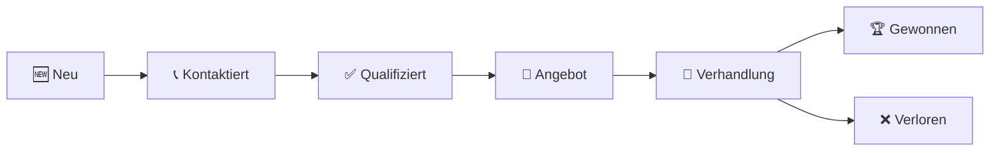

# 📋 Lead Management

Das Herzstück von SalesFlow AI ist das Lead Management. Hier erfassen, bearbeiten und konvertieren Sie potenzielle Kunden.

---

## 1. Übersicht (Lead Liste)

Wenn Sie auf **"Leads & Kontakte"** in der Sidebar klicken, sehen Sie die Übersicht aller aktiven Leads.

> **📸 Screenshot Anweisung:**
> - Mache einen Screenshot der LeadListPage
> - Highlight: Markiere die **Suchleiste** oben rechts (rot)
> - Highlight: Markiere die **Filter-Tags** (z.B. "Status: Neu") (grün)
> - Caption: *"Die Lead-Liste mit aktiven Filtern und Suchfunktion"*

### Wichtige Funktionen

| Feature | Beschreibung |
|---------|--------------|
| 🔍 **Suche** | Durchsucht Namen, Firmen und E-Mails in Echtzeit |
| 🏷️ **Filter** | Klicken Sie auf "Filter", um nach Status, Priorität oder Score zu filtern |
| ⚡ **Quick Actions** | Hovern Sie über eine Zeile für Edit/Delete Buttons |
| 📊 **Score** | Farbcodierter AI-Score (Grün: 70+, Gelb: 40-69, Rot: <40) |

---

## 2. Neuen Lead erstellen

Um einen neuen Kontakt manuell hinzuzufügen:

1. Klicken Sie oben rechts auf **"+ Neuer Lead"**
2. Das Modal-Fenster öffnet sich

> **📸 Screenshot Anweisung:**
> - Mache einen Screenshot vom offenen LeadForm Modal
> - Annotation: Pfeil auf das Feld "Budget" (wichtig für AI-Score)
> - State: Fülle mit Dummy-Daten ("Tony Stark", "Stark Industries")
> - Caption: *"Das Lead-Erfassungsformular mit Validierung"*

### Pflichtfelder

| Feld | Beschreibung |
|------|--------------|
| Vorname* | Mindestens 1 Zeichen |
| Nachname* | Mindestens 1 Zeichen |
| E-Mail* | Gültige E-Mail-Adresse |
| Firma | Optional, aber empfohlen |
| Telefon | Optional, Format wird validiert |

### API Import (für Developer)

Falls Sie Leads programmatisch importieren:

```bash
curl -X POST https://api.salesflow.ai/api/leads \
  -H "Authorization: Bearer YOUR_TOKEN" \
  -H "Content-Type: application/json" \
  -d '{
    "first_name": "Max",
    "last_name": "Mustermann",
    "email": "max@firma.de",
    "company": "Muster GmbH",
    "source": "website",
    "priority": "high"
  }'
```

---

## 3. Lead bearbeiten

1. Klicken Sie auf einen Lead in der Liste
2. Die Detail-Ansicht öffnet sich
3. Bearbeiten Sie Felder direkt inline oder klicken Sie "Bearbeiten"

> **📸 Screenshot Anweisung:**
> - Screenshot der Lead-Detail-Ansicht
> - Zeige: Kontakthistorie rechts, Hauptdaten links
> - Caption: *"Lead-Details mit Aktivitätshistorie"*

---

## 4. Lead Status ändern

Der Lead durchläuft verschiedene Phasen:



### Status ändern

1. Öffnen Sie den Lead
2. Klicken Sie auf den aktuellen Status (z.B. "Neu")
3. Wählen Sie den neuen Status aus dem Dropdown

> ⚠️ **Hinweis:** Nicht alle Übergänge sind erlaubt. Sie können z.B. nicht direkt von "Neu" zu "Gewonnen" wechseln.

---

## 5. Lead Score verstehen

Der **AI-Score** (0-100) berechnet sich aus:

| Faktor | Gewichtung |
|--------|------------|
| Engagement (Öffnungen, Klicks) | 30% |
| Firmengröße & Budget | 25% |
| Reaktionszeit | 20% |
| Vollständigkeit der Daten | 15% |
| Quelle (Referral > Cold) | 10% |

### Score-Interpretation

| Score | Bedeutung | Empfehlung |
|-------|-----------|------------|
| 🟢 70-100 | Hot Lead | Sofort kontaktieren! |
| 🟡 40-69 | Warm Lead | Follow-up planen |
| 🔴 0-39 | Cold Lead | Nurturing-Kampagne |

---

## 6. Bulk-Aktionen

Für mehrere Leads gleichzeitig:

1. Aktivieren Sie Checkboxen links neben den Leads
2. Klicken Sie "Bulk-Aktionen" oben
3. Wählen Sie: **Zuweisen**, **Status ändern**, **Tags hinzufügen**, **Löschen**

> **📸 Screenshot Anweisung:**
> - Screenshot mit 3 ausgewählten Leads
> - Zeige das offene Bulk-Actions Dropdown
> - Caption: *"Mehrere Leads auf einmal bearbeiten"*

---

## 7. Leads importieren

### CSV Import

1. Klicken Sie "Import" → "CSV hochladen"
2. Wählen Sie Ihre CSV-Datei
3. Mappen Sie die Spalten zu SalesFlow-Feldern
4. Klicken Sie "Importieren"

### CSV Format

```csv
first_name,last_name,email,company,phone,source
Max,Mustermann,max@firma.de,Muster GmbH,+49123456789,website
Lisa,Schmidt,lisa@example.com,Example AG,,linkedin
```

---

## 8. Tipps & Tricks

### Tastenkürzel

| Kürzel | Aktion |
|--------|--------|
| `N` | Neuer Lead |
| `S` | Suche fokussieren |
| `F` | Filter öffnen |
| `Esc` | Modal schließen |

### Best Practices

✅ **DO:**
- Leads innerhalb von 24h kontaktieren
- Vollständige Daten erfassen
- Tags für Kampagnen nutzen

❌ **DON'T:**
- Leads ohne E-Mail anlegen
- Zu viele Status-Änderungen pro Tag
- Leads ohne Notizen archivieren

---

## Nächste Schritte

- [AI Autopilot nutzen](./autopilot.md)
- [Deals erstellen](./deals.md)
- [Analytics verstehen](./analytics.md)
