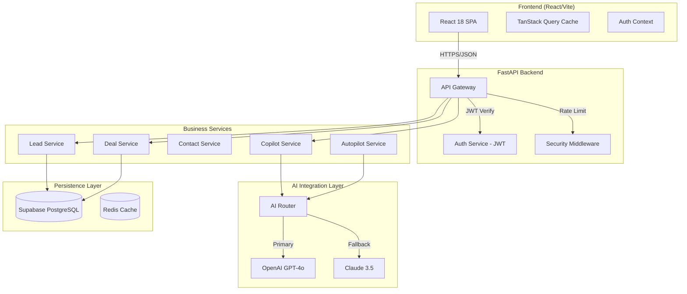
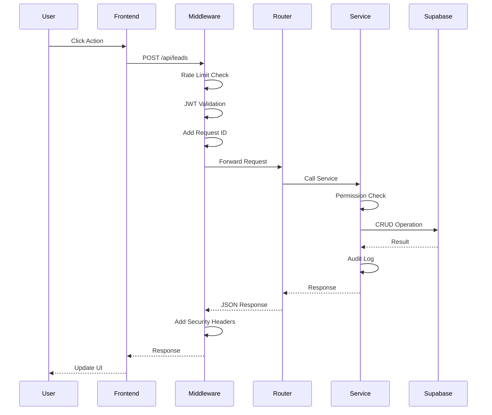
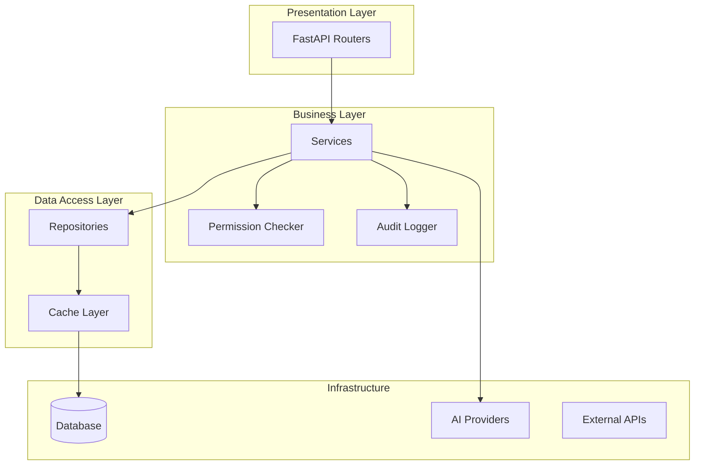

# 🏗️ System Architecture

SalesFlow AI folgt einer modernen Service-Architektur mit klarer Trennung zwischen Frontend, Backend und AI-Services.

---

## High-Level Overview



---

## Request Flow



---

## Layer Architecture



---

## Directory Structure

```
salesflow-ai/
├── backend/
│   └── app/
│       ├── main.py              # FastAPI Entry Point
│       ├── config.py            # Settings
│       ├── core/
│       │   ├── exceptions.py    # Custom Exceptions
│       │   ├── ai_types.py      # AI Type Definitions
│       │   ├── ai_policies.py   # Routing Policies
│       │   ├── ai_clients.py    # OpenAI/Claude Clients
│       │   ├── ai_router.py     # Smart AI Router
│       │   └── security/        # JWT, Password, Encryption
│       ├── middleware/
│       │   ├── rate_limiter.py
│       │   ├── security_headers.py
│       │   └── request_id.py
│       ├── services/
│       │   ├── base.py          # BaseService + Decorators
│       │   ├── lead_service.py
│       │   ├── deal_service.py
│       │   ├── contact_service.py
│       │   └── copilot_service.py
│       └── routers/
│           ├── auth.py
│           ├── leads.py
│           ├── copilot.py
│           └── ...
├── src/                         # Frontend (React)
│   ├── components/
│   ├── pages/
│   ├── hooks/
│   └── services/
└── docs/
    ├── developer/
    └── user-guide/
```

---

## Key Design Decisions

### 1. Service-Repository Pattern
- **Router**: HTTP Layer (nur Request/Response Handling)
- **Service**: Business Logic, Permissions, Audit
- **Repository**: Data Access (Supabase Queries)

### 2. AI Multi-Model Support
- **Smart Routing**: Task-basierte Modellauswahl
- **Fallback Chain**: GPT-4o → Claude → GPT-4o-mini
- **Cost Optimization**: Automatisches Downgrade bei einfachen Tasks

### 3. Security by Default
- **Rate Limiting**: Tiered (Auth: 5/5min, API: 100/min)
- **JWT + Refresh Tokens**: Mit Rotation
- **Input Sanitization**: XSS, SQL Injection Protection
- **Field Encryption**: Sensitive Daten verschlüsselt

---

## Environment Variables

```bash
# Backend (.env)
SUPABASE_URL=https://xxx.supabase.co
SUPABASE_SERVICE_ROLE_KEY=xxx
OPENAI_API_KEY=sk-xxx
ANTHROPIC_API_KEY=sk-xxx
JWT_SECRET_KEY=xxx
JWT_REFRESH_SECRET_KEY=xxx
ENCRYPTION_KEY=xxx
```

---

## Next Steps

- [Database Schema](./database-schema.md)
- [Local Setup](./setup.md)
- [API Reference](./api-reference.md)
