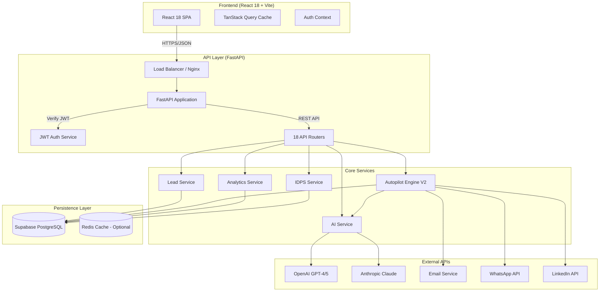
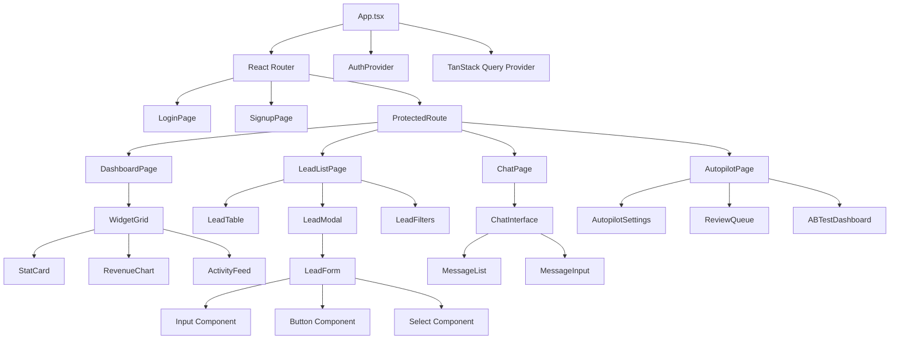
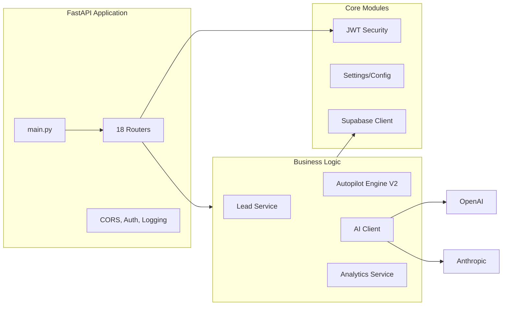
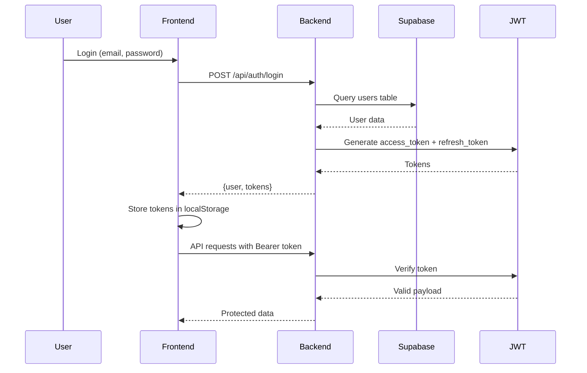
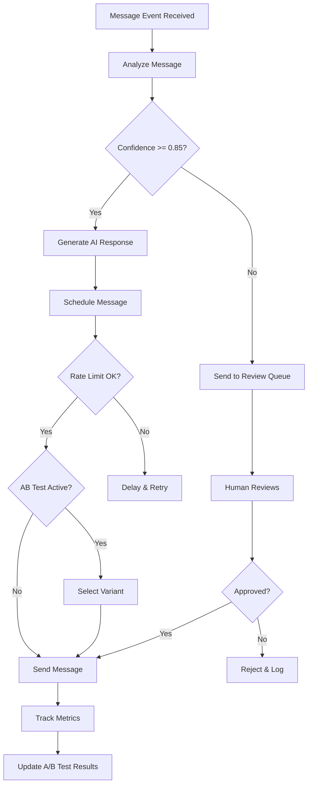
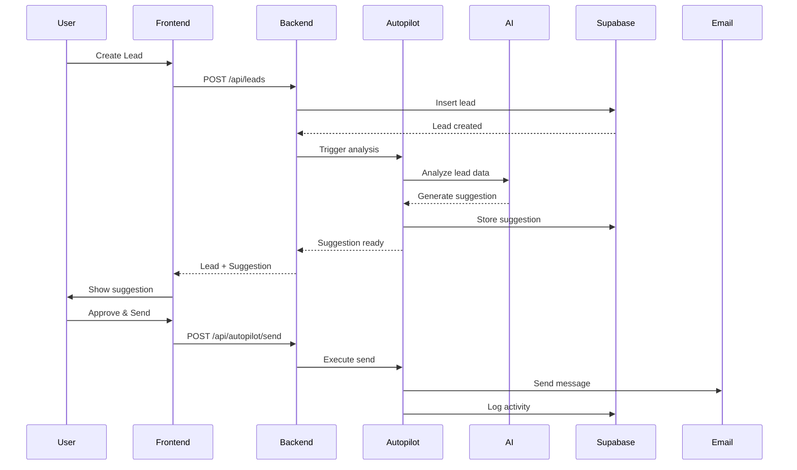
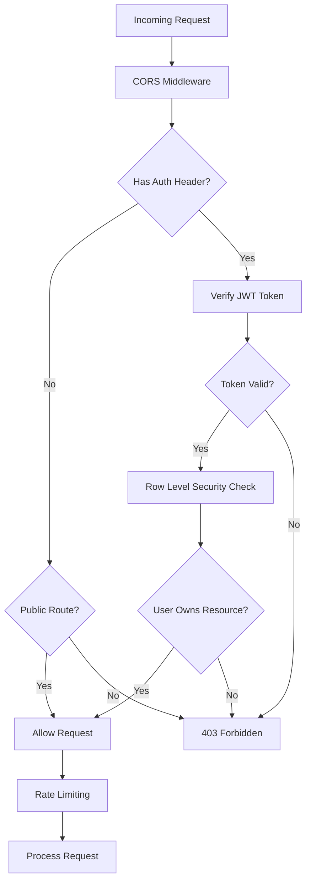
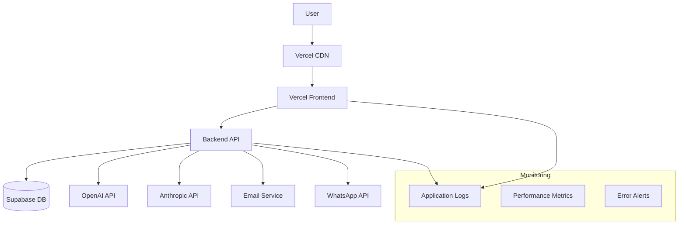

# 🏗️ System Architecture

**SalesFlow AI** folgt einer modernen **Full-Stack-Architektur** mit einem **Thin Client** Ansatz im Frontend und einem **RESTful API Backend**.

---

## High-Level Overview

Das folgende Diagramm zeigt den Datenfluss vom Client über das API Gateway bis hin zu den AI-Services.

```mermaid
graph TD
    subgraph Client ["Frontend (React 18 + Vite)"]
        UI[React 18 SPA]
        Store[TanStack Query Cache]
        Auth[Auth Context]
    end

    subgraph Backend ["API Layer (FastAPI)"]
        LB[Load Balancer / Nginx]
        Gateway[FastAPI Application]
        AuthService[JWT Auth Service]
        Routers[18 API Routers]
    end

    subgraph Services ["Core Services"]
        LeadSvc[Lead Service]
        AutopilotSvc[Autopilot Engine V2]
        AISvc[AI Service]
        AnalyticSvc[Analytics Service]
        IDPSSvc[IDPS Service]
    end

    subgraph Data ["Persistence Layer"]
        Supabase[(Supabase PostgreSQL)]
        Redis[(Redis Cache - Optional)]
    end

    subgraph External ["External APIs"]
        OpenAI[OpenAI GPT-4/5]
        Anthropic[Anthropic Claude]
        Email[Email Service]
        WhatsApp[WhatsApp API]
        LinkedIn[LinkedIn API]
    end

    UI -->|HTTPS/JSON| LB
    LB --> Gateway
    Gateway -->|Verify JWT| AuthService
    Gateway -->|REST API| Routers
    
    Routers --> LeadSvc
    Routers --> AutopilotSvc
    Routers --> AISvc
    Routers --> AnalyticSvc
    Routers --> IDPSSvc
    
    LeadSvc --> Supabase
    AutopilotSvc --> Supabase
    AutopilotSvc --> AISvc
    AISvc --> OpenAI
    AISvc --> Anthropic
    AnalyticSvc --> Supabase
    IDPSSvc --> Supabase
    
    AutopilotSvc --> Email
    AutopilotSvc --> WhatsApp
    AutopilotSvc --> LinkedIn
```

---

## Frontend Component Hierarchy

Unsere Frontend-Struktur basiert auf **Atomic Design** und **Feature-Based Organization**.

```mermaid
graph TD
    Root[App.tsx] --> Router[React Router]
    Root --> AuthProvider[AuthProvider]
    Root --> QueryProvider[TanStack Query Provider]
    
    Router --> LoginPage[LoginPage]
    Router --> SignupPage[SignupPage]
    Router --> ProtectedRoute[ProtectedRoute]
    
    ProtectedRoute --> DashboardPage[DashboardPage]
    ProtectedRoute --> LeadListPage[LeadListPage]
    ProtectedRoute --> ChatPage[ChatPage]
    ProtectedRoute --> AutopilotPage[AutopilotPage]
    
    DashboardPage --> WidgetGrid[WidgetGrid]
    WidgetGrid --> StatCard[StatCard]
    WidgetGrid --> RevenueChart[RevenueChart]
    WidgetGrid --> ActivityFeed[ActivityFeed]
    
    LeadListPage --> LeadTable[LeadTable]
    LeadListPage --> LeadModal[LeadModal]
    LeadListPage --> LeadFilters[LeadFilters]
    
    LeadModal --> LeadForm[LeadForm]
    LeadForm --> InputAtom[Input Component]
    LeadForm --> ButtonAtom[Button Component]
    LeadForm --> SelectAtom[Select Component]
    
    ChatPage --> ChatInterface[ChatInterface]
    ChatInterface --> MessageList[MessageList]
    ChatInterface --> MessageInput[MessageInput]
    
    AutopilotPage --> AutopilotSettings[AutopilotSettings]
    AutopilotPage --> ReviewQueue[ReviewQueue]
    AutopilotPage --> ABTestDashboard[ABTestDashboard]
```

---

## Backend Service Architecture

```mermaid
graph LR
    subgraph FastAPI["FastAPI Application"]
        Main[main.py]
        Routers[18 Routers]
        Middleware[CORS, Auth, Logging]
    end
    
    subgraph Core["Core Modules"]
        Security[JWT Security]
        Config[Settings/Config]
        SupabaseClient[Supabase Client]
    end
    
    subgraph Services["Business Logic"]
        LeadService[Lead Service]
        AutopilotEngine[Autopilot Engine V2]
        AIClient[AI Client]
        AnalyticsService[Analytics Service]
    end
    
    Main --> Routers
    Routers --> Security
    Routers --> Services
    Services --> SupabaseClient
    Services --> AIClient
    AIClient --> OpenAI
    AIClient --> Anthropic
```

---

## Authentication Flow

```mermaid
sequenceDiagram
    participant User
    participant Frontend
    participant Backend
    participant Supabase
    participant JWT

    User->>Frontend: Login (email, password)
    Frontend->>Backend: POST /api/auth/login
    Backend->>Supabase: Query users table
    Supabase-->>Backend: User data
    Backend->>JWT: Generate access_token + refresh_token
    JWT-->>Backend: Tokens
    Backend-->>Frontend: {user, tokens}
    Frontend->>Frontend: Store tokens in localStorage
    Frontend->>Backend: API requests with Bearer token
    Backend->>JWT: Verify token
    JWT-->>Backend: Valid payload
    Backend-->>Frontend: Protected data
```

---

## Autopilot Engine V2 Flow

```mermaid
graph TD
    Start[Message Event Received] --> Analyze[Analyze Message]
    Analyze --> Confidence{Confidence >= 0.85?}
    
    Confidence -->|Yes| Generate[Generate AI Response]
    Confidence -->|No| Review[Send to Review Queue]
    
    Generate --> Schedule[Schedule Message]
    Schedule --> RateLimit{Rate Limit OK?}
    
    RateLimit -->|Yes| ABTest{AB Test Active?}
    RateLimit -->|No| Delay[Delay & Retry]
    
    ABTest -->|Yes| SelectVariant[Select Variant]
    ABTest -->|No| Send[Send Message]
    
    SelectVariant --> Send
    Send --> Track[Track Metrics]
    Track --> Update[Update A/B Test Results]
    
    Review --> HumanReview[Human Reviews]
    HumanReview --> Approve{Approved?}
    Approve -->|Yes| Send
    Approve -->|No| Reject[Reject & Log]
```

---

## Data Flow: Lead Creation to Conversion

```mermaid
sequenceDiagram
    participant User
    participant Frontend
    participant Backend
    participant Autopilot
    participant AI
    participant Supabase

    User->>Frontend: Create Lead
    Frontend->>Backend: POST /api/leads
    Backend->>Supabase: Insert lead
    Supabase-->>Backend: Lead created
    
    Backend->>Autopilot: Trigger analysis
    Autopilot->>AI: Analyze lead data
    AI-->>Autopilot: Generate suggestion
    Autopilot->>Supabase: Store suggestion
    Autopilot-->>Backend: Suggestion ready
    Backend-->>Frontend: Lead + Suggestion
    
    Frontend->>User: Show suggestion
    User->>Frontend: Approve & Send
    Frontend->>Backend: POST /api/autopilot/send
    Backend->>Autopilot: Execute send
    Autopilot->>Email: Send message
    Autopilot->>Supabase: Log activity
```

---

## Technology Stack

### Frontend
- **Framework:** React 18 + TypeScript
- **Build Tool:** Vite
- **State Management:** TanStack Query (React Query)
- **Styling:** TailwindCSS
- **Routing:** React Router v6
- **Forms:** React Hook Form
- **Charts:** Recharts / Chart.js

### Backend
- **Framework:** FastAPI (Python 3.11+)
- **Database:** Supabase (PostgreSQL)
- **Authentication:** JWT (python-jose)
- **Password Hashing:** bcrypt (passlib)
- **API Documentation:** OpenAPI/Swagger (automatic)

### AI Services
- **Primary:** OpenAI GPT-4 / GPT-5
- **Secondary:** Anthropic Claude Opus
- **Fallback:** Gemini 3 Ultra

### Infrastructure
- **Database:** Supabase (managed PostgreSQL)
- **Hosting:** Vercel (Frontend), Railway/Render (Backend)
- **CDN:** Vercel Edge Network

---

## API Endpoints Overview

### Authentication (`/api/auth`)
- `POST /signup` - User registration
- `POST /login` - User login
- `POST /refresh` - Refresh access token
- `POST /logout` - User logout
- `GET /me` - Get current user
- `POST /change-password` - Change password

### Leads (`/api/leads`)
- `GET /` - List leads
- `POST /` - Create lead
- `GET /{id}` - Get lead details
- `PUT /{id}` - Update lead
- `DELETE /{id}` - Delete lead

### Autopilot (`/api/autopilot`)
- `GET /settings` - Get autopilot settings
- `POST /settings` - Update autopilot settings
- `POST /message-event` - Create message event
- `GET /message-events` - List message events
- `POST /approve` - Approve AI suggestion
- `POST /reject` - Reject AI suggestion

### Analytics (`/api/analytics`)
- `GET /dashboard` - Dashboard statistics
- `GET /revenue` - Revenue data
- `GET /conversion-rates` - Conversion metrics

---

## Security Architecture

```mermaid
graph TD
    Request[Incoming Request] --> CORS[CORS Middleware]
    CORS --> Auth{Has Auth Header?}
    
    Auth -->|No| PublicRoute{Public Route?}
    Auth -->|Yes| VerifyJWT[Verify JWT Token]
    
    PublicRoute -->|Yes| Allow[Allow Request]
    PublicRoute -->|No| Reject[401 Unauthorized]
    
    VerifyJWT --> Valid{Token Valid?}
    Valid -->|Yes| RLS[Row Level Security Check]
    Valid -->|No| Reject
    
    RLS --> UserMatch{User Owns Resource?}
    UserMatch -->|Yes| Allow
    UserMatch -->|No| Reject[403 Forbidden]
    
    Allow --> RateLimit[Rate Limiting]
    RateLimit --> Process[Process Request]
```

---

## Deployment Architecture

```mermaid
graph TD
    User[User] --> CDN[Vercel CDN]
    CDN --> Frontend[Vercel Frontend]
    
    Frontend --> API[Backend API]
    API --> Supabase[(Supabase DB)]
    
    API --> OpenAI[OpenAI API]
    API --> Anthropic[Anthropic API]
    
    API --> Email[Email Service]
    API --> WhatsApp[WhatsApp API]
    
    subgraph Monitoring
        Logs[Application Logs]
        Metrics[Performance Metrics]
        Alerts[Error Alerts]
    end
    
    API --> Logs
    Frontend --> Logs
```

---

## Next Steps

- [ ] Add detailed API documentation
- [ ] Add deployment guides
- [ ] Add troubleshooting section
- [ ] Add performance optimization guide

