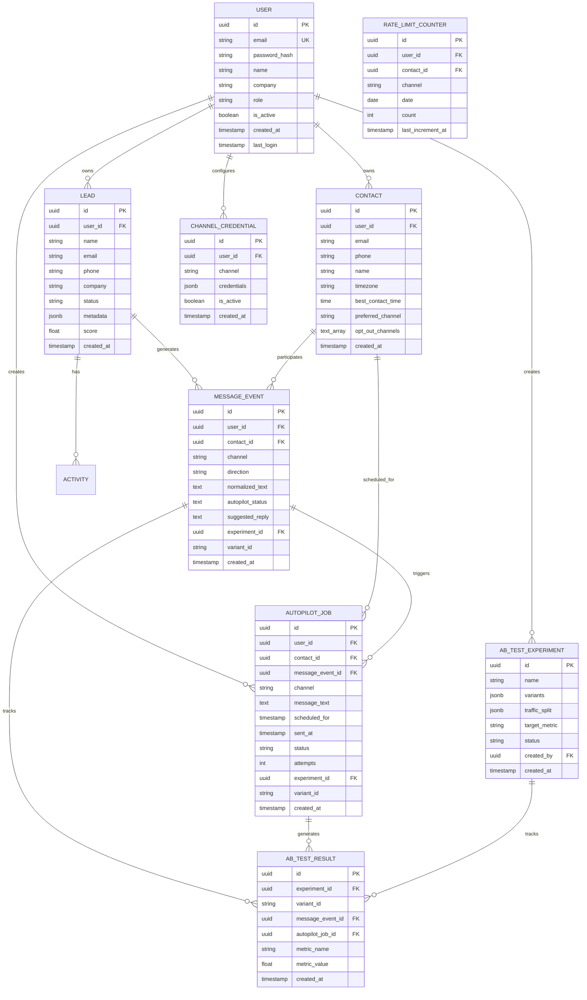

# 🗄️ Database Schema

**SalesFlow AI** nutzt **PostgreSQL** über **Supabase**. Hier ist die vollständige Datenbankstruktur.

---

## Entity Relationship Diagram (ERD)



---

## Core Tables

### `users`
User accounts für Authentication und Authorization.

| Column | Type | Constraints | Description |
|--------|------|-------------|-------------|
| `id` | UUID | PRIMARY KEY | Unique user identifier |
| `email` | VARCHAR(255) | UNIQUE, NOT NULL | User email (used for login) |
| `password_hash` | VARCHAR(255) | NOT NULL | Bcrypt hashed password |
| `name` | VARCHAR(100) | NOT NULL | User full name |
| `company` | VARCHAR(200) | | Company name |
| `role` | VARCHAR(50) | DEFAULT 'user' | Role: user, admin, superadmin |
| `is_active` | BOOLEAN | DEFAULT true | Account active status |
| `created_at` | TIMESTAMPTZ | DEFAULT NOW() | Account creation time |
| `updated_at` | TIMESTAMPTZ | | Last update time |
| `last_login` | TIMESTAMPTZ | | Last successful login |

**Indexes:**
- `idx_users_email` on `email`
- `idx_users_role` on `role`
- `idx_users_is_active` on `is_active`

---

### `leads`
Sales leads und prospects.

| Column | Type | Constraints | Description |
|--------|------|-------------|-------------|
| `id` | UUID | PRIMARY KEY | Unique lead identifier |
| `user_id` | UUID | NOT NULL, FK → users | Owner of the lead |
| `name` | TEXT | | Lead full name |
| `email` | TEXT | | Lead email address |
| `phone` | TEXT | | Lead phone number |
| `company` | TEXT | | Company name |
| `status` | TEXT | | Lead status (new, qualified, closed, etc.) |
| `metadata` | JSONB | DEFAULT '{}' | Additional lead data |
| `score` | FLOAT | | Lead score (0-100) |
| `created_at` | TIMESTAMPTZ | DEFAULT NOW() | Lead creation time |
| `updated_at` | TIMESTAMPTZ | | Last update time |

**Indexes:**
- `idx_leads_user_id` on `user_id`
- `idx_leads_status` on `status`
- `idx_leads_created_at` on `created_at DESC`

---

### `contacts`
Extended contact information with Autopilot V2 fields.

| Column | Type | Constraints | Description |
|--------|------|-------------|-------------|
| `id` | UUID | PRIMARY KEY | Unique contact identifier |
| `user_id` | UUID | NOT NULL, FK → users | Owner of the contact |
| `email` | TEXT | | Contact email |
| `phone` | TEXT | | Contact phone |
| `name` | TEXT | | Contact name |
| `timezone` | VARCHAR(50) | DEFAULT 'UTC' | IANA timezone (e.g., Europe/Berlin) |
| `best_contact_time` | TIME | | Preferred contact time |
| `preferred_channel` | VARCHAR(50) | DEFAULT 'email' | Preferred channel |
| `opt_out_channels` | TEXT[] | DEFAULT '{}' | Channels user opted out from |
| `linkedin_id` | VARCHAR(200) | | LinkedIn identifier |
| `instagram_id` | VARCHAR(200) | | Instagram identifier |
| `whatsapp_number` | VARCHAR(50) | | WhatsApp number |
| `created_at` | TIMESTAMPTZ | DEFAULT NOW() | Contact creation time |
| `updated_at` | TIMESTAMPTZ | | Last update time |

**Indexes:**
- `idx_contacts_user_id` on `user_id`
- `idx_contacts_email` on `email`
- `idx_contacts_timezone` on `timezone`
- `idx_contacts_preferred_channel` on `preferred_channel`

---

### `message_events`
Unified message events for Autopilot processing.

| Column | Type | Constraints | Description |
|--------|------|-------------|-------------|
| `id` | UUID | PRIMARY KEY | Unique event identifier |
| `user_id` | UUID | NOT NULL, FK → users | Owner |
| `contact_id` | UUID | FK → contacts | Contact involved |
| `channel` | TEXT | NOT NULL | Channel: email, whatsapp, linkedin, etc. |
| `direction` | TEXT | NOT NULL | Direction: inbound, outbound |
| `normalized_text` | TEXT | NOT NULL | Normalized message text |
| `autopilot_status` | TEXT | DEFAULT 'pending' | Status: pending, suggested, approved, sent, skipped |
| `suggested_reply` | TEXT | | AI-generated reply suggestion |
| `experiment_id` | UUID | FK → ab_test_experiments | A/B test experiment |
| `variant_id` | TEXT | | A/B test variant |
| `created_at` | TIMESTAMPTZ | DEFAULT NOW() | Event creation time |

**Indexes:**
- `idx_message_events_user_contact` on `(user_id, contact_id)`
- `idx_message_events_user_status` on `(user_id, autopilot_status)`
- `idx_message_events_created_at` on `created_at DESC`
- `idx_message_events_channel` on `channel`

---

### `autopilot_jobs`
Scheduled autopilot messages.

| Column | Type | Constraints | Description |
|--------|------|-------------|-------------|
| `id` | UUID | PRIMARY KEY | Unique job identifier |
| `user_id` | UUID | NOT NULL, FK → users | Owner |
| `contact_id` | UUID | NOT NULL, FK → contacts | Target contact |
| `message_event_id` | UUID | FK → message_events | Triggering event |
| `channel` | TEXT | NOT NULL | Channel to send via |
| `message_text` | TEXT | NOT NULL | Message content |
| `scheduled_for` | TIMESTAMPTZ | NOT NULL | When to send (UTC) |
| `sent_at` | TIMESTAMPTZ | | When actually sent |
| `status` | TEXT | DEFAULT 'pending' | Status: pending, sending, sent, failed, cancelled |
| `attempts` | INT | DEFAULT 0 | Retry attempts |
| `max_attempts` | INT | DEFAULT 3 | Max retry attempts |
| `error_message` | TEXT | | Error message if failed |
| `experiment_id` | UUID | FK → ab_test_experiments | A/B test experiment |
| `variant_id` | TEXT | | A/B test variant |
| `metadata` | JSONB | DEFAULT '{}' | Additional metadata |
| `created_at` | TIMESTAMPTZ | DEFAULT NOW() | Job creation time |
| `updated_at` | TIMESTAMPTZ | | Last update time |

**Indexes:**
- `idx_autopilot_jobs_scheduled` on `scheduled_for` WHERE `status = 'pending'`
- `idx_autopilot_jobs_user` on `user_id`
- `idx_autopilot_jobs_contact` on `contact_id`
- `idx_autopilot_jobs_status` on `status`

---

### `ab_test_experiments`
A/B test experiments for template optimization.

| Column | Type | Constraints | Description |
|--------|------|-------------|-------------|
| `id` | UUID | PRIMARY KEY | Unique experiment identifier |
| `name` | TEXT | NOT NULL | Experiment name |
| `description` | TEXT | | Experiment description |
| `status` | TEXT | DEFAULT 'active' | Status: draft, active, paused, completed |
| `variants` | JSONB | NOT NULL | Array of variants: `[{id: 'A', template: '...'}]` |
| `traffic_split` | JSONB | DEFAULT '{}' | Traffic split: `{A: 0.5, B: 0.5}` |
| `target_metric` | TEXT | NOT NULL | Target metric: reply_rate, conversion_rate, open_rate |
| `context` | TEXT | | Context: objection_handler, follow_up, etc. |
| `min_sample_size` | INT | DEFAULT 30 | Minimum sample size |
| `created_by` | UUID | NOT NULL, FK → users | Creator |
| `created_at` | TIMESTAMPTZ | DEFAULT NOW() | Creation time |
| `started_at` | TIMESTAMPTZ | | Start time |
| `ended_at` | TIMESTAMPTZ | | End time |
| `winner_variant_id` | TEXT | | Winning variant |

**Indexes:**
- `idx_ab_experiments_status` on `status`
- `idx_ab_experiments_context` on `context`
- `idx_ab_experiments_created_by` on `created_by`

---

### `ab_test_results`
Metrics tracking for A/B tests.

| Column | Type | Constraints | Description |
|--------|------|-------------|-------------|
| `id` | UUID | PRIMARY KEY | Unique result identifier |
| `experiment_id` | UUID | NOT NULL, FK → ab_test_experiments | Experiment |
| `variant_id` | TEXT | NOT NULL | Variant ID (A, B, C, etc.) |
| `message_event_id` | UUID | FK → message_events | Related message event |
| `autopilot_job_id` | UUID | FK → autopilot_jobs | Related job |
| `contact_id` | UUID | NOT NULL | Contact involved |
| `metric_name` | TEXT | NOT NULL | Metric: sent, opened, replied, converted, clicked |
| `metric_value` | FLOAT | DEFAULT 1.0 | Metric value |
| `metadata` | JSONB | DEFAULT '{}' | Additional metadata |
| `created_at` | TIMESTAMPTZ | DEFAULT NOW() | Result creation time |

**Indexes:**
- `idx_ab_results_experiment` on `experiment_id`
- `idx_ab_results_variant` on `(experiment_id, variant_id)`
- `idx_ab_results_metric` on `metric_name`

---

### `rate_limit_counters`
Daily message counters for rate limiting.

| Column | Type | Constraints | Description |
|--------|------|-------------|-------------|
| `id` | UUID | PRIMARY KEY | Unique counter identifier |
| `user_id` | UUID | NOT NULL, FK → users | User |
| `contact_id` | UUID | NOT NULL, FK → contacts | Contact |
| `channel` | TEXT | NOT NULL | Channel |
| `date` | DATE | NOT NULL | Date (YYYY-MM-DD) |
| `count` | INT | DEFAULT 0 | Message count for this day |
| `last_increment_at` | TIMESTAMPTZ | DEFAULT NOW() | Last increment time |

**Unique Constraint:** `(user_id, contact_id, channel, date)`

**Indexes:**
- `idx_rate_limit_date` on `date`
- `idx_rate_limit_user_contact` on `(user_id, contact_id)`
- `idx_rate_limit_channel` on `channel`

---

### `channel_credentials`
Encrypted API credentials for messaging channels.

| Column | Type | Constraints | Description |
|--------|------|-------------|-------------|
| `id` | UUID | PRIMARY KEY | Unique credential identifier |
| `user_id` | UUID | NOT NULL, FK → users | Owner |
| `channel` | TEXT | NOT NULL | Channel: email, whatsapp, linkedin, etc. |
| `credentials` | JSONB | NOT NULL | Encrypted credentials: `{api_key: '...', phone_id: '...'}` |
| `is_active` | BOOLEAN | DEFAULT true | Active status |
| `last_verified_at` | TIMESTAMPTZ | | Last verification time |
| `created_at` | TIMESTAMPTZ | DEFAULT NOW() | Creation time |
| `updated_at` | TIMESTAMPTZ | | Last update time |

**Unique Constraint:** `(user_id, channel)`

**Indexes:**
- `idx_channel_creds_user` on `user_id`
- `idx_channel_creds_channel` on `channel`

---

## Row Level Security (RLS)

Alle Tabellen haben **Row Level Security (RLS)** aktiviert. Policies stellen sicher, dass Benutzer nur auf ihre eigenen Daten zugreifen können.

**Beispiel Policy:**
```sql
CREATE POLICY autopilot_jobs_user_own ON autopilot_jobs
    FOR ALL
    USING (user_id = auth.uid());
```

---

## Relationships Summary

- **User** → **1:N** → Leads, Contacts, Autopilot Jobs, A/B Tests
- **Lead** → **1:N** → Message Events, Activities
- **Contact** → **1:N** → Message Events, Autopilot Jobs
- **Message Event** → **1:N** → Autopilot Jobs, A/B Test Results
- **A/B Test Experiment** → **1:N** → A/B Test Results
- **Autopilot Job** → **1:N** → A/B Test Results

---

## Migration Files

Alle Migrations befinden sich in:
- `backend/migrations/` - Backend-spezifische Migrations
- `supabase/migrations/` - Supabase Migrations

**Wichtige Migrations:**
- `20250105_create_users_table.sql` - User authentication
- `20250106_autopilot_v2_tables.sql` - Autopilot V2 tables
- `20251205_create_message_events.sql` - Message events

---

## Next Steps

- [ ] Add database indexes optimization guide
- [ ] Add backup and restore procedures
- [ ] Add data migration guides
- [ ] Add performance tuning tips

