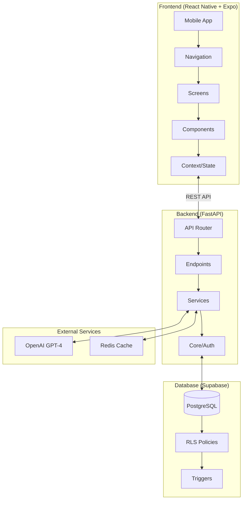
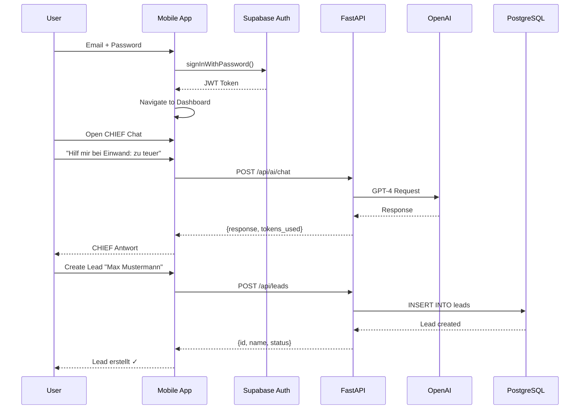
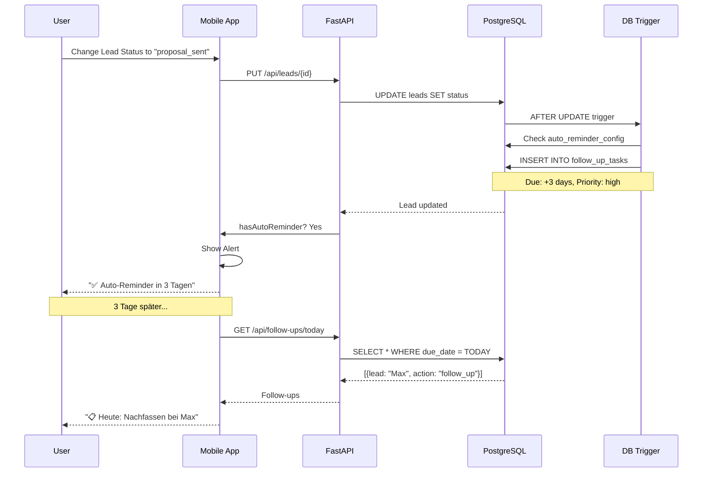
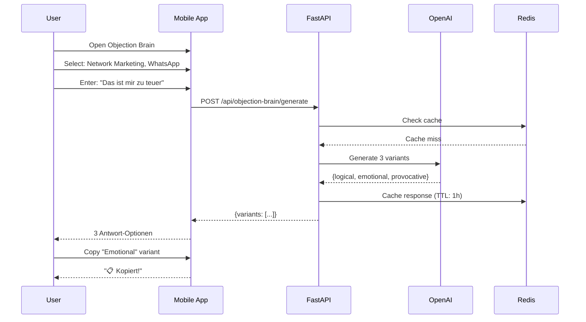

# 🏗️ Sales Flow AI - Architecture Overview

> **Technische Dokumentation** | Pflichtlektüre für neue Entwickler  
> High-Level Architektur und System-Flows

---

## 📑 Inhaltsverzeichnis

1. [Pflichtlektüre](#-pflichtlektüre-für-neue-devs)
2. [High-Level Architektur](#-high-level-architektur)
3. [Tech Stack](#-tech-stack)
4. [Haupt-Flows](#-haupt-flows)
5. [Ordnerstruktur](#-ordnerstruktur)
6. [Datenfluss](#-datenfluss)

---

## 📚 Pflichtlektüre für neue Devs

**In dieser Reihenfolge lesen:**

1. ✅ **Diese Datei** (ARCHITECTURE_OVERVIEW.md)
2. 📊 **DATA_MODEL.md** - Entities & Beziehungen
3. 👥 **LEADS.md** - Lead-Verwaltung (Kern-Entity)
4. 📋 **FOLLOW_UP_SYSTEM.md** - Auto-Reminder
5. 🔐 **SECURITY_AND_COMPLIANCE.md** - Auth & RLS

---

## 🏗 High-Level Architektur



### Komponenten-Übersicht

| Schicht | Technologie | Verantwortung |
|---------|-------------|---------------|
| **Frontend** | React Native + Expo | UI, Navigation, State |
| **Backend** | FastAPI + Python 3.11 | Business Logic, API |
| **Database** | Supabase PostgreSQL | Daten, Auth, RLS |
| **Cache** | Redis | Session, Rate Limiting |
| **AI** | OpenAI GPT-4 | CHIEF Coach, Objection Brain |

---

## 🛠 Tech Stack

### Frontend

| Technologie | Version | Verwendung |
|-------------|---------|------------|
| React Native | 0.73+ | Mobile Framework |
| Expo | 50+ | Build & Deployment |
| React Navigation | 6.x | Navigation |
| Supabase JS | 2.x | Auth & Realtime |
| AsyncStorage | 1.x | Lokaler Storage |

### Backend

| Technologie | Version | Verwendung |
|-------------|---------|------------|
| Python | 3.11+ | Runtime |
| FastAPI | 0.109+ | Web Framework |
| Uvicorn | 0.27+ | ASGI Server |
| Pydantic | 2.x | Validation |
| OpenAI | 1.x | AI Integration |
| Redis | 5.x | Caching |

### Database

| Technologie | Version | Verwendung |
|-------------|---------|------------|
| PostgreSQL | 15+ | Hauptdatenbank |
| Supabase | - | BaaS Platform |
| pgvector | - | Embeddings (geplant) |

---

## 🔄 Haupt-Flows

### Flow 1: User Login → CHIEF Chat → Lead anlegen



### Flow 2: Lead Status → Auto-Reminder → Follow-up



### Flow 3: Objection Brain Workflow



---

## 📂 Ordnerstruktur

```
salesflow-app/
├── 📱 Frontend (React Native)
│   ├── App.js                    # Entry Point
│   ├── app.json                  # Expo Config
│   └── src/
│       ├── components/           # Wiederverwendbare UI
│       │   ├── ActionButton.js
│       │   ├── Card.js
│       │   ├── LeadCard.js
│       │   └── ...
│       ├── context/
│       │   └── AuthContext.js    # Auth State
│       ├── docs/                 # 📚 Dokumentation
│       │   ├── ARCHITECTURE_OVERVIEW.md
│       │   ├── DATA_MODEL.md
│       │   ├── LEADS.md
│       │   └── ...
│       ├── hooks/
│       │   └── useSuccessPatterns.js
│       ├── navigation/
│       │   └── AppNavigator.js   # Stack/Tab Navigation
│       ├── screens/
│       │   ├── auth/
│       │   │   ├── LoginScreen.js
│       │   │   └── RegisterScreen.js
│       │   └── main/
│       │       ├── ChatScreen.js         # CHIEF Coach
│       │       ├── DashboardScreen.js
│       │       ├── FollowUpsScreen.js
│       │       ├── LeadsScreen.js
│       │       ├── NextBestActionsScreen.js
│       │       ├── ObjectionBrainScreen.js
│       │       └── PlaybooksScreen.js
│       └── services/
│           ├── autoReminderService.js
│           └── supabase.js
│
├── 🐍 Backend (FastAPI)
│   └── backend/
│       ├── requirements.txt
│       ├── run.py                # Dev Server
│       └── app/
│           ├── __init__.py
│           ├── config.py         # Settings
│           ├── main.py           # FastAPI App
│           ├── api/              # Endpoints
│           │   ├── __init__.py
│           │   ├── ai.py         # CHIEF Chat
│           │   ├── followups.py
│           │   ├── health.py
│           │   ├── leads.py
│           │   └── objection_brain.py
│           ├── core/             # Core Modules
│           │   ├── __init__.py
│           │   ├── auth.py       # Authentication
│           │   ├── database.py   # Supabase Client
│           │   └── security.py   # JWT, Hashing
│           └── services/         # Business Logic
│               ├── __init__.py
│               ├── ai_service.py
│               └── cache_service.py
│
└── 🗄️ Database (Migrations)
    └── src/backend/migrations/
        ├── 003_power_up_system.sql
        ├── 005_follow_up_tasks_table.sql
        ├── 006_auto_reminder_trigger.sql
        └── DEPLOY_ALL_MIGRATIONS.sql
```

---

## 🌊 Datenfluss

### Schreib-Operation (Create Lead)

```
User Input → React Native Screen
           → fetch() POST /api/leads
           → FastAPI Router
           → Pydantic Validation
           → Supabase Client
           → PostgreSQL INSERT
           → RLS Policy Check ✓
           → Return to Frontend
           → Update Local State
           → UI Re-render
```

### Lese-Operation (Get Leads)

```
Screen Mount → useEffect()
            → fetch() GET /api/leads
            → FastAPI Router
            → Auth Middleware (JWT)
            → Supabase Query
            → PostgreSQL SELECT
            → RLS Filter (user_id = auth.uid())
            → Return JSON
            → useState Update
            → FlatList Render
```

### AI-Operation (CHIEF Chat)

```
User Message → ChatScreen
            → fetch() POST /api/ai/chat
            → FastAPI Router
            → AIService.chat()
            → OpenAI API Call
            → Response Processing
            → Optional: Cache in Redis
            → Return to Frontend
            → Append to messages[]
            → ScrollView Update
```

---

## 🔗 Weitere Dokumentationen

| Dokument | Beschreibung |
|----------|--------------|
| [DATA_MODEL.md](./DATA_MODEL.md) | Entity Relationships |
| [SECURITY_AND_COMPLIANCE.md](./SECURITY_AND_COMPLIANCE.md) | Auth & DSGVO |
| [LEADS.md](./LEADS.md) | Lead-Verwaltung |
| [FOLLOW_UP_SYSTEM.md](./FOLLOW_UP_SYSTEM.md) | Auto-Reminder |
| [AI_CHAT.md](./AI_CHAT.md) | CHIEF Coach |

---

> **Sales Flow AI** | Architecture Overview | 2024
