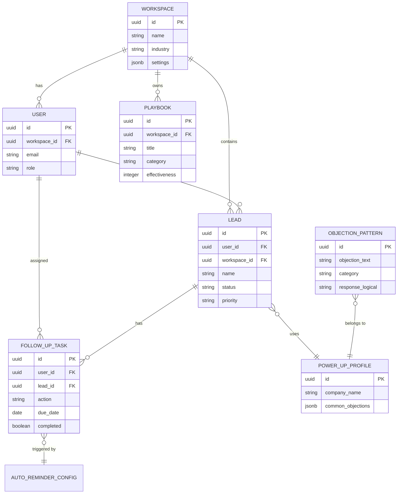

# 📊 Sales Flow AI - Data Model

> **Technische Dokumentation** | Business View  
> Entities, Beziehungen und kritische Tabellen

---

## 📑 Inhaltsverzeichnis

1. [Kern-Entities](#-kern-entities)
2. [Entity Relationship Diagram](#-entity-relationship-diagram)
3. [Tabellen-Details](#-tabellen-details)
4. [Kritische Tabellen für Analytics](#-kritische-tabellen-für-analytics)
5. [JSONB-Felder](#-jsonb-felder)

---

## 🎯 Kern-Entities

### User

```typescript
interface User {
  id: UUID;                    // Supabase Auth ID
  email: string;
  full_name?: string;
  workspace_id: UUID;          // Gehört zu Workspace
  team_id?: UUID;              // Team-Zugehörigkeit
  role: 'rep' | 'team_lead' | 'admin';
  created_at: timestamp;
}
```

**Beschreibung:**
- Repräsentiert einen Vertriebsmitarbeiter
- Authentifiziert via Supabase Auth
- Gehört zu genau einem Workspace
- Kann Teil eines Teams sein

---

### Workspace / Company

```typescript
interface Workspace {
  id: UUID;
  name: string;
  industry: 'network' | 'real_estate' | 'finance';
  settings: JSONB;             // Workspace-Konfiguration
  subscription_tier: 'solo' | 'team' | 'enterprise';
  created_at: timestamp;
}
```

**Beschreibung:**
- Container für alle Daten (Multi-Tenancy Basis)
- Definiert Branche und Abonnement
- Alle User/Leads/Tasks gehören zu einem Workspace

---

### Lead / Contact

```typescript
interface Lead {
  id: UUID;
  user_id: UUID;               // Besitzer
  workspace_id: UUID;          // Workspace
  
  // Basisdaten
  name: string;
  company?: string;
  email?: string;
  phone?: string;
  
  // Status & Priorisierung
  status: LeadStatus;
  priority: 'high' | 'medium' | 'low';
  
  // Tracking
  source: 'manual' | 'import' | 'screenshot' | 'webhook';
  last_contact?: timestamp;
  notes?: string;
  
  // Custom Fields
  custom_fields?: JSONB;
  
  // Timestamps
  created_at: timestamp;
  updated_at: timestamp;
  deleted_at?: timestamp;      // Soft Delete
}

type LeadStatus = 
  | 'new'           // Neu erstellt
  | 'contacted'     // Kontaktiert
  | 'qualified'     // Qualifiziert
  | 'proposal_sent' // Angebot gesendet
  | 'won'           // Gewonnen
  | 'lost'          // Verloren
  | 'dormant'       // Inaktiv
  | 'on_hold';      // Pausiert
```

**Beschreibung:**
- Kern-Entity für Vertrieb
- Hat Status-Machine (siehe LEADS.md)
- Trigger bei Status-Änderung → Auto-Reminder

---

### FollowUpTask

```typescript
interface FollowUpTask {
  id: UUID;
  user_id: UUID;
  lead_id?: UUID;              // Optional verknüpft
  lead_name: string;           // Cached für Performance
  
  // Task Details
  action: 'call' | 'email' | 'meeting' | 'message' | 'follow_up';
  description: string;
  
  // Scheduling
  due_date: date;
  due_time?: time;
  priority: 'low' | 'medium' | 'high' | 'urgent';
  
  // Status
  completed: boolean;
  completed_at?: timestamp;
  
  // Reminder
  reminder_at?: timestamp;
  reminder_sent: boolean;
  
  // Auto-Generated
  auto_generated?: boolean;
  trigger_status?: string;     // z.B. "proposal_sent"
  
  // Timestamps
  created_at: timestamp;
  updated_at: timestamp;
}
```

**Beschreibung:**
- Automatisch generierte Aufgaben
- Verknüpft mit Lead (optional)
- Trigger für Push-Notifications

---

### Playbook

```typescript
interface Playbook {
  id: UUID;
  workspace_id: UUID;
  created_by: UUID;
  
  // Content
  title: string;
  description: string;
  category: 'opener' | 'followup' | 'closing' | 'objection';
  steps: string[];             // Array von Schritten
  
  // Analytics
  effectiveness: number;       // 0-100
  uses_count: number;
  conversions_count: number;
  
  // Status
  is_active: boolean;
  is_public: boolean;          // Team-sichtbar?
  
  created_at: timestamp;
  updated_at: timestamp;
}
```

**Beschreibung:**
- Vordefinierte Vertriebsstrategien
- Effectiveness Score wird berechnet
- Kann vom User erstellt werden

---

### PowerUpProfile (Company Intelligence)

```typescript
interface PowerUpProfile {
  id: UUID;
  company_name: string;        // z.B. "Zinzino"
  vertical: string;
  
  // Firmendaten
  founded_year?: number;
  headquarters?: string;
  website?: string;
  
  // Produkte
  product_categories: string[];
  flagship_products: string[];
  price_range: 'low' | 'mid' | 'premium';
  
  // Vergütung
  comp_plan_type: string;
  entry_cost_min?: number;
  entry_cost_max?: number;
  
  // Sales Intelligence
  common_objections: JSONB;
  unique_selling_points: string[];
  best_opener?: string;
  best_closing_technique?: string;
  ideal_customer_profile?: string;
  golden_questions: string[];
  
  // Performance
  avg_closing_rate: number;
  avg_deal_size?: number;
  
  is_active: boolean;
  created_at: timestamp;
}
```

---

### ObjectionPattern

```typescript
interface ObjectionPattern {
  id: UUID;
  objection_text: string;      // "Das ist mir zu teuer"
  objection_category: string;  // "price"
  severity: number;            // 1-10
  
  // Antwort-Strategien
  response_logical: string;
  response_emotional: string;
  response_provocative: string;
  
  // DISG-Varianten
  response_for_d: string;      // Dominant
  response_for_i: string;      // Initiativ
  response_for_s: string;      // Stetig
  response_for_g: string;      // Gewissenhaft
  
  // Meta
  follow_up_question: string;
  bridge_to_close: string;
  success_rate: number;
  times_used: number;
  
  vertical: string;            // "all" oder spezifisch
  is_active: boolean;
}
```

---

## 🔗 Entity Relationship Diagram



---

## 📋 Tabellen-Details

### Basis-Schema für alle Tabellen

```sql
-- Standard-Spalten
id UUID PRIMARY KEY DEFAULT gen_random_uuid(),
created_at TIMESTAMPTZ DEFAULT NOW() NOT NULL,
updated_at TIMESTAMPTZ DEFAULT NOW() NOT NULL,
deleted_at TIMESTAMPTZ,  -- Soft Delete

-- Ownership
user_id UUID REFERENCES auth.users(id),
workspace_id UUID REFERENCES workspaces(id) NOT NULL,
```

### Indexes

```sql
-- Performance-kritische Indexes
CREATE INDEX idx_leads_user_id ON leads(user_id);
CREATE INDEX idx_leads_status ON leads(status);
CREATE INDEX idx_leads_workspace_id ON leads(workspace_id);

CREATE INDEX idx_followups_user_due ON follow_up_tasks(user_id, due_date);
CREATE INDEX idx_followups_completed ON follow_up_tasks(completed);

CREATE INDEX idx_objections_category ON objection_library(objection_category);
```

---

## 📈 Kritische Tabellen für Analytics

### 1. leads (Conversions)

```sql
-- Conversion Rate berechnen
SELECT 
  COUNT(*) FILTER (WHERE status = 'won') * 100.0 / 
  NULLIF(COUNT(*), 0) as conversion_rate,
  DATE_TRUNC('month', created_at) as month
FROM leads
WHERE workspace_id = :workspace_id
GROUP BY month;
```

### 2. follow_up_tasks (Completion Rate)

```sql
-- Task Completion Rate
SELECT 
  COUNT(*) FILTER (WHERE completed = true) * 100.0 / 
  NULLIF(COUNT(*), 0) as completion_rate,
  user_id
FROM follow_up_tasks
WHERE due_date BETWEEN :start_date AND :end_date
GROUP BY user_id;
```

### 3. events (Usage Tracking)

```sql
-- Event Tracking Schema
CREATE TABLE events (
  id UUID PRIMARY KEY DEFAULT gen_random_uuid(),
  user_id UUID NOT NULL,
  workspace_id UUID NOT NULL,
  event_type TEXT NOT NULL,  -- 'lead_created', 'chat_sent', etc.
  metadata JSONB,
  created_at TIMESTAMPTZ DEFAULT NOW()
);

-- Events pro Tag
SELECT 
  event_type,
  COUNT(*) as count,
  DATE_TRUNC('day', created_at) as day
FROM events
WHERE workspace_id = :workspace_id
GROUP BY event_type, day;
```

---

## 📦 JSONB-Felder

### Lead Custom Fields

```typescript
interface LeadCustomFields {
  product_package?: string;
  contract_duration_months?: number;
  preferred_contact_time?: 'morning' | 'afternoon' | 'evening';
  referral_source?: string;
  bant_score?: number;
  disc_type?: 'D' | 'I' | 'S' | 'G';
  tags?: string[];
  [key: string]: unknown;
}
```

### Workspace Settings

```typescript
interface WorkspaceSettings {
  default_follow_up_days: number;
  auto_reminder_enabled: boolean;
  notification_channels: string[];
  timezone: string;
  language: 'de' | 'en';
  branding?: {
    logo_url?: string;
    primary_color?: string;
  };
}
```

### Common Objections (Power-Up)

```typescript
interface CommonObjections {
  [objection: string]: string;  // "zu teuer": "Antwort..."
}

// Beispiel:
{
  "zu teuer": "Der BalanceTest allein kostet beim Arzt 200€.",
  "MLM Skepsis": "Verstehe ich. Aber das Produkt funktioniert."
}
```

---

## 🔄 Status-Übergänge

### Lead Status Machine

```
new → contacted → qualified → proposal_sent → won
                      ↓              ↓          ↓
                    lost          lost     dormant
                      ↓
                   on_hold → active
```

### FollowUp Status

```
pending → in_progress → completed
              ↓
           skipped
           snoozed
```

---

## 📚 Weiterführend

- [LEADS.md](./LEADS.md) - State Machine Details
- [FOLLOW_UP_SYSTEM.md](./FOLLOW_UP_SYSTEM.md) - Auto-Reminder
- [POWER_UP_SYSTEM.md](./POWER_UP_SYSTEM.md) - Company Intelligence

---

> **Sales Flow AI** | Data Model | 2024
