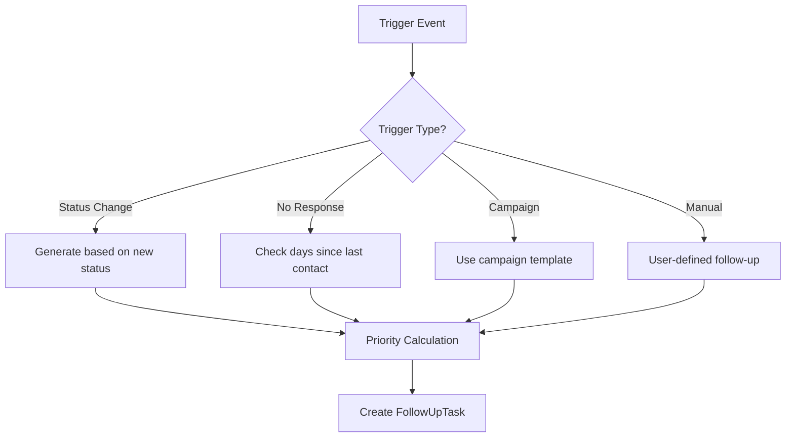

# 📋 Sales Flow AI - Follow-up System

> **Technische Dokumentation** | Version 1.0  
> Vollständige Dokumentation des Follow-up Systems inkl. automatischer Reminder-Erstellung

---

## 📑 Inhaltsverzeichnis

1. [Überblick](#-überblick)
2. [Architektur](#-architektur)
3. [Frontend: FollowUpsScreen](#-frontend-followupsscreen)
4. [Service: autoReminderService](#-service-autoreminderservice)
5. [Datenbank: Tabellen & Trigger](#-datenbank-tabellen--trigger)
6. [API-Endpunkte](#-api-endpunkte)
7. [Datenmodell](#-datenmodell)
8. [Nutzung & Beispiele](#-nutzung--beispiele)

---

## 🎯 Überblick

Das **Follow-up System** ist ein zentraler Bestandteil von Sales Flow AI und ermöglicht:

- ✅ **Manuelle Follow-ups**: Nutzer erstellen Tasks für Leads
- ✅ **Automatische Reminder**: Trigger bei Status-Änderungen (z.B. `proposal_sent`)
- ✅ **Kategorisierung**: Überfällig / Heute / Diese Woche / Später
- ✅ **Priorisierung**: Hoch / Mittel / Niedrig
- ✅ **Aktionstypen**: Anrufen, E-Mail, Meeting, Nachricht, Follow-up

### Kernfunktion
Wenn ein Lead auf **"Angebot gesendet" (`proposal_sent`)** gesetzt wird, erstellt das System automatisch einen Follow-up Task mit 3 Tagen Frist.

---

## 🏗 Architektur

```
┌─────────────────────────────────────────────────────────────────┐
│                        FRONTEND (React Native)                   │
├─────────────────────────────────────────────────────────────────┤
│  FollowUpsScreen.js                                              │
│  - Anzeige aller Follow-ups                                      │
│  - Erstellen neuer Follow-ups                                    │
│  - Abhaken/Erledigen von Tasks                                   │
└─────────────────────────────────────────────────────────────────┘
                              │
                              ▼
┌─────────────────────────────────────────────────────────────────┐
│                     SERVICE LAYER (JavaScript)                   │
├─────────────────────────────────────────────────────────────────┤
│  autoReminderService.js                                          │
│  - createAutoReminder()                                          │
│  - hasAutoReminder()                                             │
│  - getAutoReminderConfig()                                       │
└─────────────────────────────────────────────────────────────────┘
                              │
                              ▼
┌─────────────────────────────────────────────────────────────────┐
│                         API (Backend)                            │
├─────────────────────────────────────────────────────────────────┤
│  GET    /api/follow-ups?user_id=...                              │
│  POST   /api/follow-ups                                          │
│  PUT    /api/follow-ups/:id                                      │
│  DELETE /api/follow-ups/:id                                      │
└─────────────────────────────────────────────────────────────────┘
                              │
                              ▼
┌─────────────────────────────────────────────────────────────────┐
│                    DATENBANK (PostgreSQL/Supabase)               │
├─────────────────────────────────────────────────────────────────┤
│  follow_up_tasks         - Speichert alle Tasks                  │
│  auto_reminder_config    - Konfiguration für Auto-Reminder       │
│  leads                   - Lead-Daten mit Status                 │
├─────────────────────────────────────────────────────────────────┤
│  TRIGGER: trigger_auto_reminder_on_lead_status                   │
│  → Erstellt automatisch Follow-up bei Status-Änderung            │
└─────────────────────────────────────────────────────────────────┘
```

---

## 📱 Frontend: FollowUpsScreen

**Datei:** `src/screens/main/FollowUpsScreen.js`

### Beschreibung
React Native Screen zur Verwaltung aller Follow-up Tasks. Bietet eine übersichtliche Darstellung mit Kategorisierung nach Fälligkeit.

### Props & Navigation

```javascript
// Navigation wird übergeben
export default function FollowUpsScreen({ navigation }) { ... }
```

### State Management

| State | Typ | Beschreibung |
|-------|-----|--------------|
| `followUps` | `Array` | Liste aller Follow-ups |
| `loading` | `Boolean` | Ladezustand |
| `refreshing` | `Boolean` | Pull-to-Refresh aktiv |
| `showCompleted` | `Boolean` | Erledigte anzeigen/verstecken |
| `modalVisible` | `Boolean` | Neues Follow-up Modal |
| `newFollowUp` | `Object` | Formular-Daten für neues Follow-up |

### Konfiguration

```javascript
// Prioritäten mit Farben
const PRIORITY_CONFIG = {
  high:   { label: '🔥 Hoch',    color: '#ef4444', bgColor: '#fee2e2' },
  medium: { label: '⚡ Mittel',  color: '#f59e0b', bgColor: '#fef3c7' },
  low:    { label: '📌 Niedrig', color: '#64748b', bgColor: '#f1f5f9' },
};

// Aktionstypen
const ACTION_TYPES = {
  call:      { label: '📞 Anrufen',   icon: '📞' },
  email:     { label: '📧 E-Mail',    icon: '📧' },
  meeting:   { label: '🤝 Meeting',   icon: '🤝' },
  message:   { label: '💬 Nachricht', icon: '💬' },
  follow_up: { label: '📋 Follow-up', icon: '📋' },
};
```

### Hauptfunktionen

#### `fetchFollowUps()`
Lädt alle Follow-ups vom API-Server. Bei Fehler werden Demo-Daten verwendet.

```javascript
const fetchFollowUps = useCallback(async () => {
  try {
    const response = await fetch(`${API_URL}/api/follow-ups?user_id=${user?.id || ''}`);
    if (response.ok) {
      const data = await response.json();
      setFollowUps(data.follow_ups || data || []);
    } else {
      setFollowUps(SAMPLE_FOLLOWUPS); // Fallback
    }
  } catch (error) {
    setFollowUps(SAMPLE_FOLLOWUPS);
  }
}, [user]);
```

#### `toggleComplete(followUpId)`
Markiert ein Follow-up als erledigt oder öffnet es wieder.

#### `createFollowUp()`
Erstellt ein neues Follow-up über das Modal.

#### `categorizeFollowUp(followUp)`
Kategorisiert Follow-ups nach Fälligkeit:
- `overdue` – Überfällig
- `today` – Heute fällig
- `week` – Diese Woche
- `later` – Später
- `completed` – Erledigt

### UI-Komponenten

| Komponente | Beschreibung |
|------------|--------------|
| `FollowUpCard` | Einzelne Follow-up Karte mit Checkbox |
| `SectionHeader` | Überschrift für Kategorien (z.B. "Überfällig") |
| `Stats Bar` | Statistik-Leiste oben |
| `FAB` | Floating Action Button zum Erstellen |
| `Modal` | Formular für neues Follow-up |

---

## ⚙️ Service: autoReminderService

**Datei:** `src/services/autoReminderService.js`

### Beschreibung
JavaScript Service für automatische Follow-up Erstellung bei Lead-Status-Änderungen.

### Konfiguration

```javascript
export const AUTO_REMINDER_CONFIG = {
  proposal_sent: {
    enabled: true,
    daysUntilFollowUp: 3,      // 3 Tage nach Angebot
    priority: 'high',
    action: 'follow_up',
    descriptionTemplate: (leadName) => 
      `Nachfassen: Angebot an ${leadName} - Entscheidung erfragen`,
    reminderMessage: '📋 Auto-Reminder erstellt: Follow-up in 3 Tagen'
  }
};
```

### Exportierte Funktionen

#### `createAutoReminder({ leadId, leadName, userId, newStatus })`

Erstellt automatisch einen Follow-up Task basierend auf dem neuen Lead-Status.

**Parameter:**
| Parameter | Typ | Beschreibung |
|-----------|-----|--------------|
| `leadId` | `string` | UUID des Leads |
| `leadName` | `string` | Name des Leads |
| `userId` | `string` | UUID des Benutzers |
| `newStatus` | `string` | Neuer Status (z.B. `proposal_sent`) |

**Rückgabe:**
```javascript
{
  success: true,
  followUp: { id, lead_id, description, due_date, ... },
  message: '📋 Auto-Reminder erstellt: Follow-up in 3 Tagen',
  isLocal: false  // true wenn API nicht erreichbar
}
```

**Beispiel:**
```javascript
import { createAutoReminder } from '../services/autoReminderService';

const result = await createAutoReminder({
  leadId: 'uuid-123',
  leadName: 'Max Mustermann',
  userId: 'user-uuid',
  newStatus: 'proposal_sent'
});

if (result?.success) {
  console.log(result.message);  // "📋 Auto-Reminder erstellt..."
}
```

#### `hasAutoReminder(status)`

Prüft ob für einen Status Auto-Reminder konfiguriert sind.

```javascript
if (hasAutoReminder('proposal_sent')) {
  // Reminder wird erstellt
}
```

#### `getAutoReminderConfig(status)`

Gibt die Konfiguration für einen Status zurück.

```javascript
const config = getAutoReminderConfig('proposal_sent');
// { enabled: true, daysUntilFollowUp: 3, priority: 'high', ... }
```

---

## 🗄 Datenbank: Tabellen & Trigger

### Tabelle: `follow_up_tasks`

**Migration:** `005_follow_up_tasks_table.sql`

```sql
CREATE TABLE public.follow_up_tasks (
  id UUID PRIMARY KEY DEFAULT gen_random_uuid(),
  user_id UUID NOT NULL REFERENCES auth.users(id) ON DELETE CASCADE,
  
  -- Lead Reference (optional)
  lead_id UUID REFERENCES public.leads(id) ON DELETE SET NULL,
  lead_name TEXT,
  
  -- Task Details
  action TEXT NOT NULL DEFAULT 'follow_up' 
    CHECK (action IN ('call', 'email', 'meeting', 'message', 'follow_up', 'task')),
  description TEXT NOT NULL,
  
  -- Scheduling
  due_date DATE NOT NULL DEFAULT CURRENT_DATE,
  due_time TIME,
  
  -- Priority
  priority TEXT NOT NULL DEFAULT 'medium' 
    CHECK (priority IN ('low', 'medium', 'high', 'urgent')),
  
  -- Status
  completed BOOLEAN NOT NULL DEFAULT FALSE,
  completed_at TIMESTAMPTZ,
  
  -- Reminder
  reminder_at TIMESTAMPTZ,
  reminder_sent BOOLEAN DEFAULT FALSE,
  
  -- Timestamps
  created_at TIMESTAMPTZ NOT NULL DEFAULT NOW(),
  updated_at TIMESTAMPTZ NOT NULL DEFAULT NOW()
);
```

### Tabelle: `auto_reminder_config`

**Migration:** `006_auto_reminder_trigger.sql`

```sql
CREATE TABLE public.auto_reminder_config (
  id UUID PRIMARY KEY DEFAULT gen_random_uuid(),
  trigger_status TEXT NOT NULL UNIQUE,      -- z.B. 'proposal_sent'
  enabled BOOLEAN NOT NULL DEFAULT TRUE,
  days_until_followup INTEGER NOT NULL DEFAULT 3,
  priority TEXT NOT NULL DEFAULT 'high',
  action_type TEXT NOT NULL DEFAULT 'follow_up',
  description_template TEXT NOT NULL,       -- mit {lead_name} Platzhalter
  created_at TIMESTAMPTZ NOT NULL DEFAULT NOW(),
  updated_at TIMESTAMPTZ NOT NULL DEFAULT NOW()
);
```

### Indexes

```sql
-- Performance-Optimierung
CREATE INDEX idx_follow_up_tasks_user_id ON follow_up_tasks(user_id);
CREATE INDEX idx_follow_up_tasks_lead_id ON follow_up_tasks(lead_id);
CREATE INDEX idx_follow_up_tasks_due_date ON follow_up_tasks(due_date);
CREATE INDEX idx_follow_up_tasks_completed ON follow_up_tasks(completed);
CREATE INDEX idx_follow_up_tasks_priority ON follow_up_tasks(priority);

-- Composite Index für häufige Abfragen
CREATE INDEX idx_follow_up_tasks_user_due_completed 
  ON follow_up_tasks(user_id, due_date, completed);
```

### Row Level Security (RLS)

```sql
-- Users sehen nur eigene Tasks
CREATE POLICY "follow_up_tasks_select_own"
  ON follow_up_tasks FOR SELECT
  USING (user_id = auth.uid());

CREATE POLICY "follow_up_tasks_insert_own"
  ON follow_up_tasks FOR INSERT
  WITH CHECK (user_id = auth.uid());

CREATE POLICY "follow_up_tasks_update_own"
  ON follow_up_tasks FOR UPDATE
  USING (user_id = auth.uid())
  WITH CHECK (user_id = auth.uid());

CREATE POLICY "follow_up_tasks_delete_own"
  ON follow_up_tasks FOR DELETE
  USING (user_id = auth.uid());
```

### Trigger: Auto-Reminder bei Status-Änderung

```sql
CREATE OR REPLACE FUNCTION create_auto_reminder_on_status_change()
RETURNS TRIGGER AS $$
DECLARE
  config_record RECORD;
  description TEXT;
BEGIN
  -- Nur bei Status-Änderung
  IF OLD.status IS DISTINCT FROM NEW.status THEN
    -- Konfiguration suchen
    SELECT * INTO config_record
    FROM auto_reminder_config
    WHERE trigger_status = NEW.status AND enabled = TRUE;
    
    IF FOUND THEN
      -- Platzhalter ersetzen
      description := REPLACE(config_record.description_template, 
                             '{lead_name}', COALESCE(NEW.name, 'Lead'));
      
      -- Follow-up erstellen
      INSERT INTO follow_up_tasks (
        user_id, lead_id, lead_name, action, description,
        due_date, priority, completed
      ) VALUES (
        NEW.user_id, NEW.id, NEW.name, config_record.action_type,
        description, CURRENT_DATE + config_record.days_until_followup,
        config_record.priority, FALSE
      );
    END IF;
  END IF;
  RETURN NEW;
END;
$$ LANGUAGE plpgsql;

-- Trigger auf Leads-Tabelle
CREATE TRIGGER trigger_auto_reminder_on_lead_status
  AFTER UPDATE OF status ON leads
  FOR EACH ROW
  EXECUTE FUNCTION create_auto_reminder_on_status_change();
```

### Views

```sql
-- Überfällige Tasks
CREATE VIEW v_overdue_tasks AS
SELECT t.*, l.name, l.email, l.phone, l.status,
       CURRENT_DATE - t.due_date as days_overdue
FROM follow_up_tasks t
LEFT JOIN leads l ON t.lead_id = l.id
WHERE t.completed = FALSE AND t.due_date < CURRENT_DATE
ORDER BY t.due_date ASC;

-- Heutige Tasks
CREATE VIEW v_today_tasks AS
SELECT t.*, l.name, l.email, l.phone
FROM follow_up_tasks t
LEFT JOIN leads l ON t.lead_id = l.id
WHERE t.completed = FALSE AND t.due_date = CURRENT_DATE
ORDER BY t.priority DESC, t.due_time ASC NULLS LAST;
```

---

## 🌐 API-Endpunkte

**Base URL:** `http://localhost:8000`

### GET `/api/follow-ups`

Listet alle Follow-ups eines Users.

**Query Parameter:**
| Parameter | Typ | Beschreibung |
|-----------|-----|--------------|
| `user_id` | `string` | UUID des Benutzers |

**Response:**
```json
{
  "follow_ups": [
    {
      "id": "uuid",
      "lead_name": "Max Mustermann",
      "action": "call",
      "description": "Angebot besprechen",
      "due_date": "2024-01-15",
      "priority": "high",
      "completed": false
    }
  ]
}
```

### POST `/api/follow-ups`

Erstellt ein neues Follow-up.

**Body:**
```json
{
  "user_id": "uuid",
  "lead_id": "uuid",
  "lead_name": "Max Mustermann",
  "action": "call",
  "description": "Angebot besprechen",
  "due_date": "2024-01-15",
  "priority": "high",
  "completed": false
}
```

### PUT `/api/follow-ups/:id`

Aktualisiert ein Follow-up (z.B. als erledigt markieren).

**Body:**
```json
{
  "completed": true
}
```

### DELETE `/api/follow-ups/:id`

Löscht ein Follow-up.

---

## 📊 Datenmodell

### Follow-up Task Object

```typescript
interface FollowUpTask {
  id: string;              // UUID
  user_id: string;         // UUID des Besitzers
  lead_id?: string;        // UUID des verknüpften Leads
  lead_name?: string;      // Name des Leads (cached)
  
  action: 'call' | 'email' | 'meeting' | 'message' | 'follow_up' | 'task';
  description: string;
  
  due_date: string;        // YYYY-MM-DD
  due_time?: string;       // HH:mm
  
  priority: 'low' | 'medium' | 'high' | 'urgent';
  
  completed: boolean;
  completed_at?: string;   // ISO Timestamp
  
  reminder_at?: string;
  reminder_sent?: boolean;
  
  auto_generated?: boolean;
  trigger_status?: string;
  
  created_at: string;
  updated_at: string;
}
```

### Auto-Reminder Config Object

```typescript
interface AutoReminderConfig {
  trigger_status: string;    // z.B. 'proposal_sent'
  enabled: boolean;
  days_until_followup: number;
  priority: 'low' | 'medium' | 'high' | 'urgent';
  action_type: string;
  description_template: string;  // mit {lead_name} Platzhalter
}
```

---

## 🚀 Nutzung & Beispiele

### 1. Neues Follow-up erstellen (UI)

1. Tippe auf den **+ Button** unten rechts
2. Fülle das Formular aus:
   - Kontakt/Lead Name
   - Aktion wählen (Anrufen, E-Mail, etc.)
   - Beschreibung
   - Fälligkeitsdatum
   - Priorität
3. Tippe auf "✨ Follow-up erstellen"

### 2. Auto-Reminder aktivieren

Der Auto-Reminder wird **automatisch** ausgelöst, wenn:
- Ein Lead-Status auf `proposal_sent` geändert wird
- Die Konfiguration in `auto_reminder_config` aktiv ist

**Beispiel: Lead-Status ändern**
```javascript
// Im LeadsScreen oder per API
await updateLeadStatus(leadId, 'proposal_sent');
// → Automatisch wird Follow-up in 3 Tagen erstellt
```

### 3. Auto-Reminder manuell triggern

```javascript
import { createAutoReminder } from '../services/autoReminderService';

// Nach Angebots-Versand
const onSendProposal = async (lead) => {
  // Angebot senden...
  
  // Auto-Reminder erstellen
  const result = await createAutoReminder({
    leadId: lead.id,
    leadName: lead.name,
    userId: currentUser.id,
    newStatus: 'proposal_sent'
  });
  
  if (result?.success) {
    Alert.alert('✅', result.message);
  }
};
```

### 4. Neue Auto-Reminder Konfiguration hinzufügen

**In der Datenbank:**
```sql
INSERT INTO auto_reminder_config (
  trigger_status,
  enabled,
  days_until_followup,
  priority,
  action_type,
  description_template
) VALUES (
  'qualified',           -- Trigger bei Status "qualified"
  TRUE,
  7,                     -- 7 Tage später
  'medium',
  'call',
  'Follow-up: {lead_name} qualifiziert - Termin vereinbaren'
);
```

**Im Service:**
```javascript
// autoReminderService.js erweitern
export const AUTO_REMINDER_CONFIG = {
  proposal_sent: { ... },
  qualified: {
    enabled: true,
    daysUntilFollowUp: 7,
    priority: 'medium',
    action: 'call',
    descriptionTemplate: (leadName) => 
      `Follow-up: ${leadName} qualifiziert - Termin vereinbaren`,
    reminderMessage: '📞 Auto-Reminder: Anruf in 7 Tagen'
  }
};
```

---

## 🔧 Fehlerbehebung

### API nicht erreichbar
Das System nutzt automatisch Demo-Daten wenn die API nicht verfügbar ist.

### Follow-ups werden nicht geladen
1. Prüfe `API_URL` in `FollowUpsScreen.js`
2. Stelle sicher, dass der Backend-Server läuft
3. Prüfe die Browser-Konsole auf Fehler

### Auto-Reminder wird nicht erstellt
1. Prüfe `auto_reminder_config` Tabelle – ist `enabled = TRUE`?
2. Prüfe ob der Trigger existiert: `SELECT * FROM pg_trigger WHERE tgname = 'trigger_auto_reminder_on_lead_status';`
3. Prüfe Supabase Logs auf Fehler

---

## 📚 Abhängigkeiten

### Frontend
- `react-native` – UI Framework
- `AuthContext` – Benutzer-Authentifizierung

### Backend
- PostgreSQL / Supabase
- UUID Extension (`uuid-ossp`)

### Services
- Fetch API für HTTP Requests

---

## 📅 Changelog

| Version | Datum | Änderungen |
|---------|-------|------------|
| 1.0 | 2024 | Initiales Release mit FollowUpsScreen, autoReminderService, DB-Migrations |

---

## 🔧 Extending this Module

### Follow-up Generierung



**Trigger-Typen:**
```typescript
type FollowUpTrigger = 
  | 'status_change'      // Lead-Status wechselt
  | 'no_response'        // X Tage keine Antwort
  | 'campaign_start'     // Kampagne gestartet
  | 'manual'             // User erstellt manuell
  | 'scheduled'          // Geplantes Follow-up
  | 'reactivation';      // Dormant → Active
```

---

### Priorisierung (Anbindung an Next Best Actions)

```typescript
function calculateFollowUpPriority(lead: Lead, task: FollowUpTask): number {
  // Basis-Score aus Next Best Actions
  const nbaPriority = calculateNBAPriority(lead);
  
  // Follow-up spezifische Boosts
  let followUpBoost = 0;
  
  // Überfälligkeit: +20 pro Tag
  const daysOverdue = getDaysOverdue(task.due_date);
  if (daysOverdue > 0) {
    followUpBoost += Math.min(daysOverdue * 20, 100);
  }
  
  // Lead-Wert
  if (lead.priority === 'high' || lead.potential_value > 5000) {
    followUpBoost += 15;
  }
  
  // Hot Status
  if (lead.status === 'active') {
    followUpBoost += 10;
  }
  
  return nbaPriority + followUpBoost;
}
```

---

### Reminder-Mechanismus

| Methode | Beschreibung | Wann |
|---------|--------------|------|
| **Cron Job** | Täglich 6:00 UTC | Überfällige Tasks markieren, E-Mail Digest |
| **Realtime** | Supabase Subscription | Neue Tasks sofort in UI |
| **Push** | Expo Push Notifications | 15min vor `due_at` |
| **In-App** | Badge Counter | Bei App-Öffnung |

**Cron Job Implementation:**
```python
# backend/app/jobs/daily_followup_check.py
from apscheduler.schedulers.asyncio import AsyncIOScheduler

async def mark_overdue_tasks():
    """Markiert überfällige Tasks und sendet Notifications."""
    
    # Überfällige Tasks finden
    overdue = await db.fetch("""
        UPDATE follow_up_tasks 
        SET is_overdue = TRUE
        WHERE due_date < CURRENT_DATE 
          AND completed = FALSE
          AND is_overdue = FALSE
        RETURNING id, user_id, description
    """)
    
    # Notifications senden
    for task in overdue:
        await send_notification(
            user_id=task['user_id'],
            title='⚠️ Überfälliges Follow-up',
            body=task['description']
        )

# Scheduler
scheduler = AsyncIOScheduler()
scheduler.add_job(mark_overdue_tasks, 'cron', hour=6)
```

---

### Snooze / Skip Logik

```typescript
interface SnoozeAction {
  task_id: string;
  snooze_until: Date;
  reason?: string;
}

interface SkipAction {
  task_id: string;
  skip_reason: 'not_relevant' | 'already_done' | 'lead_lost' | 'other';
  note?: string;
}

// Snooze Implementation
async function snoozeTask(action: SnoozeAction) {
  await supabase
    .from('follow_up_tasks')
    .update({
      due_date: action.snooze_until,
      snoozed_at: new Date(),
      snooze_reason: action.reason,
      snooze_count: supabase.sql`snooze_count + 1`
    })
    .eq('id', action.task_id);
}

// Skip Implementation
async function skipTask(action: SkipAction) {
  // 1. Task als übersprungen markieren
  await supabase
    .from('follow_up_tasks')
    .update({
      status: 'skipped',
      skip_reason: action.skip_reason,
      skip_note: action.note,
      completed_at: new Date()
    })
    .eq('id', action.task_id);
  
  // 2. Nächste Action berechnen (falls Lead noch aktiv)
  const lead = await getLeadByTaskId(action.task_id);
  if (lead && lead.status !== 'lost') {
    await generateNextBestAction(lead);
  }
  
  // 3. Analytics tracken
  await trackEvent('task_skipped', {
    task_id: action.task_id,
    reason: action.skip_reason
  });
}
```

**Was passiert bei Skip:**
1. Task wird als `skipped` markiert
2. Nächste Action wird automatisch berechnet
3. Analytics trackt Skip-Rate pro User/Grund
4. Bei häufigen Skips → Team Lead Benachrichtigung

---

### Neuen Trigger-Typ hinzufügen

**Schritt 1: Auto-Reminder Config erweitern**
```sql
-- Neuer Trigger: Wenn Lead 14 Tage inaktiv
INSERT INTO auto_reminder_config (
  trigger_status,
  enabled,
  days_until_followup,
  priority,
  action_type,
  description_template
) VALUES (
  'inactive_14_days',
  TRUE,
  0,  -- Sofort
  'high',
  'call',
  'Reactivation: {lead_name} seit 14 Tagen inaktiv - Anrufen!'
);
```

**Schritt 2: Trigger-Funktion erweitern**
```sql
-- Erweiterte Trigger-Funktion
CREATE OR REPLACE FUNCTION check_lead_inactivity()
RETURNS void AS $$
BEGIN
  -- Inaktive Leads finden
  INSERT INTO follow_up_tasks (
    user_id, lead_id, lead_name, action, description,
    due_date, priority, auto_generated
  )
  SELECT 
    l.user_id,
    l.id,
    l.name,
    'call',
    'Reactivation: ' || l.name || ' seit 14 Tagen inaktiv',
    CURRENT_DATE,
    'high',
    TRUE
  FROM leads l
  WHERE l.last_contact_at < NOW() - INTERVAL '14 days'
    AND l.status NOT IN ('won', 'lost', 'dormant')
    AND NOT EXISTS (
      -- Kein offener Task für diesen Lead
      SELECT 1 FROM follow_up_tasks t
      WHERE t.lead_id = l.id AND t.completed = FALSE
    );
END;
$$ LANGUAGE plpgsql;

-- Täglich ausführen
SELECT cron.schedule('check-inactive-leads', '0 7 * * *', 
  'SELECT check_lead_inactivity()');
```

**Schritt 3: Frontend Service erweitern**
```javascript
// autoReminderService.js
export const AUTO_REMINDER_CONFIG = {
  proposal_sent: { ... },
  qualified: { ... },
  // NEU: Inaktivitäts-Reminder
  inactive_14_days: {
    enabled: true,
    daysUntilFollowUp: 0,
    priority: 'high',
    action: 'call',
    descriptionTemplate: (leadName) => 
      `Reactivation: ${leadName} seit 14 Tagen inaktiv - Anrufen!`,
    reminderMessage: '🔔 Inaktiver Lead braucht Aufmerksamkeit!'
  }
};
```

---

### Checkliste für neue Follow-up Features

- [ ] **Trigger definiert**
  - Bedingung klar dokumentiert
  - In `auto_reminder_config` eingetragen

- [ ] **Datenbank aktualisiert**
  - Migration erstellt
  - Trigger/Cron Job implementiert

- [ ] **Frontend Service erweitert**
  - `AUTO_REMINDER_CONFIG` aktualisiert
  - `hasAutoReminder()` funktioniert

- [ ] **UI angepasst**
  - Neuer Action-Typ im Dropdown
  - Badge/Icon definiert

- [ ] **Notifications konfiguriert**
  - Push Notification Template
  - E-Mail Template (falls nötig)

- [ ] **Analytics integriert**
  - Completion Rate trackbar
  - Skip Reasons auswertbar

---

> **Erstellt für Sales Flow AI** | Follow-up Engine & Auto-Reminder System

