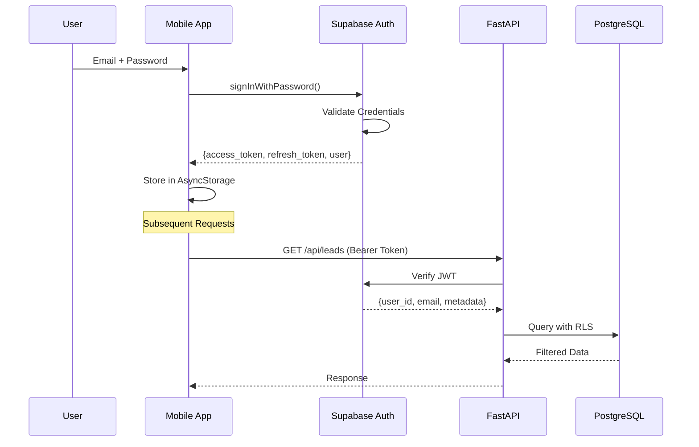

# 🔐 Sales Flow AI - Security & Compliance

> **Technische Dokumentation** | Sicherheit & DSGVO  
> Authentifizierung, Autorisierung, Datenschutz

---

## 📑 Inhaltsverzeichnis

1. [Authentication Flow](#-authentication-flow)
2. [Rollenmodell](#-rollenmodell)
3. [Row Level Security (RLS)](#-row-level-security-rls)
4. [DSGVO / Datenschutz](#-dsgvo--datenschutz)
5. [API Security](#-api-security)

---

## 🔑 Authentication Flow

### Supabase Auth Integration



### Token Handling

| Token Type | Lifetime | Storage | Refresh |
|------------|----------|---------|---------|
| Access Token | 1 Stunde | AsyncStorage | Automatisch |
| Refresh Token | 7 Tage | AsyncStorage | Bei Ablauf |
| Session | 30 Min Inaktivität | Memory | Manuell |

### Session Settings

```javascript
// src/services/supabase.js
export const supabase = createClient(supabaseUrl, supabaseKey, {
  auth: {
    storage: AsyncStorage,
    autoRefreshToken: true,      // Token vor Ablauf erneuern
    persistSession: true,        // Session speichern
    detectSessionInUrl: false,   // Mobile App
  },
});
```

---

## 👥 Rollenmodell

### Rollen-Hierarchie

```
enterprise_admin
      ↓
    admin
      ↓
  team_lead
      ↓
     rep
```

### Berechtigungs-Matrix

| Permission | rep | team_lead | admin | enterprise_admin |
|------------|-----|-----------|-------|------------------|
| **Leads** |
| Leads sehen (eigene) | ✅ | ✅ | ✅ | ✅ |
| Leads sehen (Team) | ❌ | ✅ | ✅ | ✅ |
| Leads sehen (alle) | ❌ | ❌ | ✅ | ✅ |
| Leads bearbeiten | ✅ | ✅ | ✅ | ✅ |
| Leads löschen | ❌ | ✅ | ✅ | ✅ |
| **Playbooks** |
| Playbooks ansehen | ✅ | ✅ | ✅ | ✅ |
| Playbooks erstellen | ❌ | ✅ | ✅ | ✅ |
| Playbooks löschen | ❌ | ❌ | ✅ | ✅ |
| **Team** |
| Team verwalten | ❌ | ✅ | ✅ | ✅ |
| User einladen | ❌ | ✅ | ✅ | ✅ |
| **Settings** |
| Workspace Settings | ❌ | ❌ | ✅ | ✅ |
| Billing verwalten | ❌ | ❌ | ✅ | ✅ |
| Workspaces verwalten | ❌ | ❌ | ❌ | ✅ |

### Rollen in Code

```python
# backend/app/core/auth.py
class UserRole(str, Enum):
    REP = "rep"
    TEAM_LEAD = "team_lead"
    ADMIN = "admin"
    ENTERPRISE_ADMIN = "enterprise_admin"

ROLE_PERMISSIONS = {
    UserRole.REP: [
        "view_own_leads",
        "edit_own_leads",
        "use_chief",
        "view_playbooks",
    ],
    UserRole.TEAM_LEAD: [
        # + rep permissions
        "view_team_leads",
        "create_playbooks",
        "manage_team",
    ],
    # ...
}
```

---

## 🛡️ Row Level Security (RLS)

### Konzept

RLS filtert Datenbank-Abfragen automatisch basierend auf dem authentifizierten User.

```
User A (rep) → SELECT * FROM leads
              ↓
            RLS Policy: user_id = auth.uid()
              ↓
            Nur Leads von User A zurückgegeben
```

### RLS Policies

#### Leads Policy

```sql
-- User sieht nur eigene Leads
CREATE POLICY "leads_select_own"
ON public.leads FOR SELECT
USING (user_id = auth.uid());

-- User kann nur eigene Leads bearbeiten
CREATE POLICY "leads_update_own"
ON public.leads FOR UPDATE
USING (user_id = auth.uid())
WITH CHECK (user_id = auth.uid());

-- User kann nur für sich Leads erstellen
CREATE POLICY "leads_insert_own"
ON public.leads FOR INSERT
WITH CHECK (user_id = auth.uid());
```

#### Workspace Isolation

```sql
-- Alle Daten nach Workspace isoliert
CREATE POLICY "workspace_isolation"
ON public.leads FOR ALL
USING (
  workspace_id = (
    SELECT workspace_id 
    FROM workspace_users 
    WHERE user_id = auth.uid()
  )
);
```

#### Team-Lead Policy

```sql
-- Team Lead sieht Team-Daten
CREATE POLICY "team_lead_view_team"
ON public.leads FOR SELECT
USING (
  user_id IN (
    SELECT id FROM workspace_users 
    WHERE team_id = (
      SELECT team_id FROM workspace_users 
      WHERE id = auth.uid()
    )
  )
  AND EXISTS (
    SELECT 1 FROM workspace_users 
    WHERE id = auth.uid() 
    AND role IN ('team_lead', 'admin')
  )
);
```

### Geschützte Tabellen

| Tabelle | RLS aktiv | Filter |
|---------|-----------|--------|
| `leads` | ✅ | user_id + workspace_id |
| `follow_up_tasks` | ✅ | user_id |
| `playbooks` | ✅ | workspace_id |
| `workspace_users` | ✅ | workspace_id |
| `company_intelligence` | ❌ | Öffentlich lesbar |
| `objection_library` | ❌ | Öffentlich lesbar |

---

## 📋 DSGVO / Datenschutz

### Was wird geloggt

| Daten | Gespeichert | Retention | Zweck |
|-------|-------------|-----------|-------|
| Login Events | ✅ | 30 Tage | Security |
| API Calls (Metadaten) | ✅ | 30 Tage | Debugging |
| Error Logs | ✅ | 30 Tage | Debugging |
| Chat Metadaten | ✅ | Konfigurierbar | Analytics |

### Was wird NICHT geloggt

| Daten | Grund |
|-------|-------|
| Passwörter | Sicherheit |
| Chat-Inhalte | Datenschutz |
| Vollständige Kundendaten in Logs | DSGVO |
| API Request Bodies (sensitive) | DSGVO |

### Datenaufbewahrung

| Datentyp | Retention | Löschung |
|----------|-----------|----------|
| Logs | 30 Tage | Automatisch |
| Chat History | Konfigurierbar | User-Request |
| Gelöschte Leads | 90 Tage (Soft Delete) | Automatisch |
| User-Daten | Bis zur Löschung | DSGVO-Request |

### DSGVO-Requests

```sql
-- Daten-Export für User
SELECT * FROM leads WHERE user_id = :user_id;
SELECT * FROM follow_up_tasks WHERE user_id = :user_id;
-- ...

-- Daten-Löschung (Right to be Forgotten)
DELETE FROM leads WHERE user_id = :user_id;
DELETE FROM follow_up_tasks WHERE user_id = :user_id;
DELETE FROM auth.users WHERE id = :user_id;
```

---

## 🔒 API Security

### Headers

```python
# CORS Middleware
app.add_middleware(
    CORSMiddleware,
    allow_origins=settings.cors_origins_list,
    allow_credentials=True,
    allow_methods=["*"],
    allow_headers=["*"],
)
```

### Rate Limiting

```python
# Redis-basiertes Rate Limiting
async def check_rate_limit(user_id: str, limit: int = 100, window: int = 60):
    key = f"rate_limit:{user_id}"
    current = cache_service.incr(key)
    
    if current == 1:
        cache_service.client.expire(key, window)
    
    if current > limit:
        raise HTTPException(
            status_code=429,
            detail="Rate limit exceeded"
        )
```

### Input Validation

```python
# Pydantic Validation
class LeadCreate(BaseModel):
    name: str = Field(..., min_length=1, max_length=255)
    email: Optional[str] = Field(None, regex=r'^[^@]+@[^@]+\.[^@]+$')
    phone: Optional[str] = Field(None, max_length=50)
```

### Secure Defaults

```python
# Sensitive Endpoints nur für Admins
@router.delete("/leads/{id}")
async def delete_lead(
    id: str,
    user: User = Depends(require_permission("delete_leads"))
):
    ...
```

---

## 🔐 Secrets Management

### Entwicklung

```bash
# .env (NIE committen!)
SUPABASE_URL=https://xxx.supabase.co
SUPABASE_KEY=xxx
OPENAI_API_KEY=sk-xxx
SECRET_KEY=xxx
```

### Produktion

- Secrets in Umgebungsvariablen
- Kein .env in Produktion
- Key Rotation alle 90 Tage
- Service Role Key nur Server-seitig

---

## ✅ Security Checklist

### Entwicklung

- [ ] .env in .gitignore
- [ ] Keine Secrets in Code
- [ ] RLS auf allen User-Tabellen
- [ ] Input Validation aktiv

### Deployment

- [ ] HTTPS erzwungen
- [ ] Secrets in Umgebungsvariablen
- [ ] Rate Limiting aktiv
- [ ] Error Details nur in Dev

### Laufend

- [ ] Dependency Updates
- [ ] Key Rotation
- [ ] Log-Monitoring
- [ ] Penetration Tests

---

> **Sales Flow AI** | Security & Compliance | 2024
