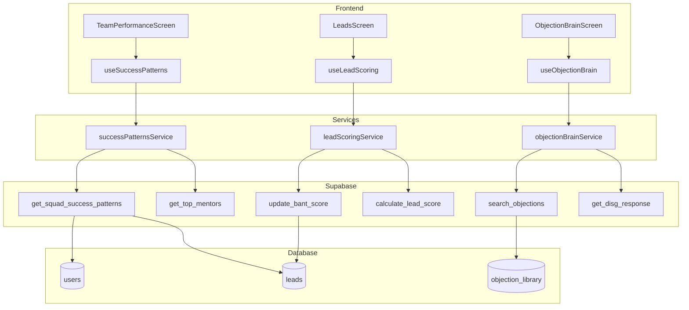
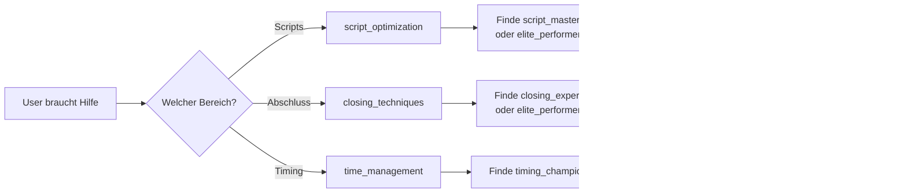
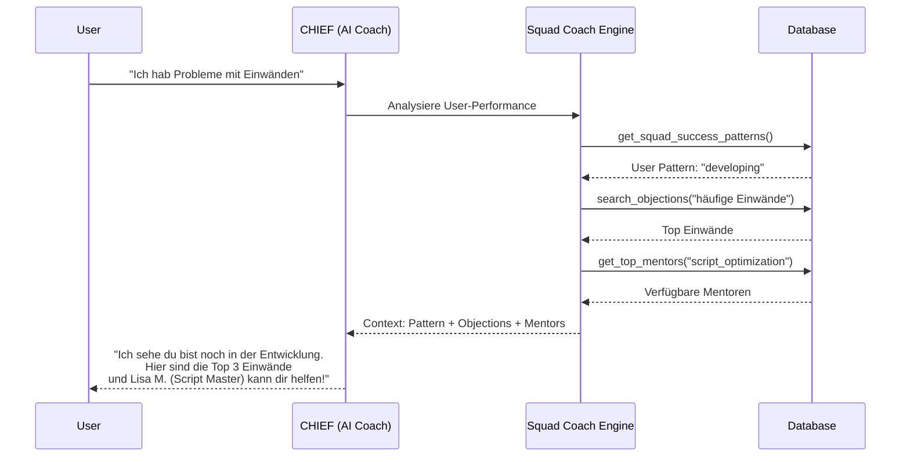

# 🏆 Sales Flow AI - Squad Coach System

> **Technische Dokumentation** | Version 1.0  
> Team-Performance-Analyse, Success Patterns & KI-gestütztes Coaching

---

## 📑 Inhaltsverzeichnis

1. [Überblick](#-überblick)
2. [Architektur](#-architektur)
3. [Success Patterns Engine](#-success-patterns-engine)
4. [CHIEF Coaching Integration](#-chief-coaching-integration)
5. [Frontend: TeamPerformanceScreen](#-frontend-teamperformancescreen)
6. [Services & Hooks](#-services--hooks)
7. [Datenbank: RPC-Funktionen](#-datenbank-rpc-funktionen)
8. [API Reference](#-api-reference)
9. [Konfiguration](#-konfiguration)
10. [Nutzung & Beispiele](#-nutzung--beispiele)
11. [Troubleshooting](#-troubleshooting)

---

## 🎯 Überblick

Das **Squad Coach System** ist das KI-gestützte Team-Coaching-Modul von Sales Flow AI:

- ✅ **Success Patterns**: Automatische Erkennung von Top-Performer-Mustern
- ✅ **Mentor-Matching**: Finde den richtigen Coach für jeden Skill-Bereich
- ✅ **BANT-Lead-Scoring**: Automatische Lead-Qualifizierung
- ✅ **Objection Brain**: DISG-spezifische Einwand-Behandlung
- ✅ **Team-Leaderboard**: Gamification & Motivation
- ✅ **CHIEF Integration**: KI-Coach mit Team-Kontext

### Kernfunktion

Das System analysiert kontinuierlich Team-Performance-Daten und identifiziert:
- **Wer** performt am besten (Top-Performer)
- **Warum** sie erfolgreich sind (Success Patterns)
- **Wie** andere davon lernen können (Mentoring)

---

## 🏗 Architektur

### High-Level Übersicht

```
┌─────────────────────────────────────────────────────────────────────────────┐
│                         SQUAD COACH SYSTEM                                   │
├─────────────────────────────────────────────────────────────────────────────┤
│                                                                              │
│  ┌─────────────┐  ┌─────────────┐  ┌─────────────┐  ┌─────────────┐        │
│  │  Success    │  │  Objection  │  │    Lead     │  │   CHIEF     │        │
│  │  Patterns   │  │    Brain    │  │   Scoring   │  │   Coach     │        │
│  └──────┬──────┘  └──────┬──────┘  └──────┬──────┘  └──────┬──────┘        │
│         │                │                │                │                │
│         └────────────────┴────────────────┴────────────────┘                │
│                                   │                                          │
│                          ┌────────┴────────┐                                │
│                          │  Squad Coach    │                                │
│                          │    Engine       │                                │
│                          └────────┬────────┘                                │
│                                   │                                          │
└───────────────────────────────────┼──────────────────────────────────────────┘
                                    │
                    ┌───────────────┴───────────────┐
                    │                               │
            ┌───────┴───────┐               ┌──────┴──────┐
            │   Frontend    │               │   Backend   │
            │  (React Native)│               │ (Supabase)  │
            └───────────────┘               └─────────────┘
```

### Detaillierte Architektur

```
┌─────────────────────────────────────────────────────────────────────────────┐
│                        FRONTEND (React Native)                               │
├─────────────────────────────────────────────────────────────────────────────┤
│                                                                              │
│  ┌──────────────────┐  ┌──────────────────┐  ┌──────────────────┐          │
│  │ TeamPerformance  │  │ ObjectionBrain   │  │    LeadsScreen   │          │
│  │     Screen       │  │     Screen       │  │  (BANT Scoring)  │          │
│  └────────┬─────────┘  └────────┬─────────┘  └────────┬─────────┘          │
│           │                     │                     │                     │
│  ┌────────┴─────────────────────┴─────────────────────┴────────┐           │
│  │                        HOOKS LAYER                           │           │
│  ├──────────────────┬──────────────────┬──────────────────────┤           │
│  │ useSuccessPatterns│ useObjectionBrain│ useLeadScoring      │           │
│  │ useMentors        │ useQuickSearch   │ useBANTForm         │           │
│  │ usePatternSummary │ useObjCategory   │ useSingleLeadScore  │           │
│  └──────────────────┴──────────────────┴──────────────────────┘           │
│                              │                                              │
│  ┌───────────────────────────┴───────────────────────────────┐             │
│  │                      SERVICES LAYER                        │             │
│  ├──────────────────┬──────────────────┬────────────────────┤             │
│  │successPatterns   │objectionBrain    │leadScoring         │             │
│  │Service.js        │Service.js        │Service.js          │             │
│  └──────────────────┴──────────────────┴────────────────────┘             │
│                              │                                              │
└──────────────────────────────┼──────────────────────────────────────────────┘
                               │
                               ▼
┌─────────────────────────────────────────────────────────────────────────────┐
│                         SUPABASE (PostgreSQL)                                │
├─────────────────────────────────────────────────────────────────────────────┤
│                                                                              │
│  ┌─────────────────────────────────────────────────────────────────────┐   │
│  │                        RPC FUNCTIONS                                 │   │
│  ├───────────────────┬───────────────────┬───────────────────────────┤   │
│  │ Success Patterns  │ Objection Brain   │ Lead Scoring              │   │
│  ├───────────────────┼───────────────────┼───────────────────────────┤   │
│  │get_squad_success_ │search_objections  │calculate_lead_score       │   │
│  │  patterns()       │get_objections_by_ │update_bant_score          │   │
│  │get_top_mentors()  │  category()       │get_leads_by_score         │   │
│  │get_pattern_       │get_disg_response()│get_lead_score_stats       │   │
│  │  summary()        │get_objection_     │                           │   │
│  │                   │  categories()     │                           │   │
│  └───────────────────┴───────────────────┴───────────────────────────┘   │
│                                                                              │
│  ┌─────────────────────────────────────────────────────────────────────┐   │
│  │                           TABLES                                     │   │
│  ├────────────────┬────────────────┬────────────────┬─────────────────┤   │
│  │     users      │     leads      │ objection_     │  follow_up_     │   │
│  │  (team_id,     │  (bant_*,      │   library      │    tasks        │   │
│  │   role)        │   lead_score,  │  (responses,   │                 │   │
│  │                │   score_cat,   │   disg_*)      │                 │   │
│  │                │   disg_type)   │                │                 │   │
│  └────────────────┴────────────────┴────────────────┴─────────────────┘   │
│                                                                              │
│  ┌─────────────────────────────────────────────────────────────────────┐   │
│  │                          TRIGGERS                                    │   │
│  ├─────────────────────────────────────────────────────────────────────┤   │
│  │ trigger_lead_score_update → Auto-Berechnung bei BANT-Änderung       │   │
│  │ trigger_auto_reminder     → Follow-up bei Status-Änderung           │   │
│  └─────────────────────────────────────────────────────────────────────┘   │
│                                                                              │
└─────────────────────────────────────────────────────────────────────────────┘
```

### Datenfluss (Mermaid)



---

## 🎯 Success Patterns Engine

### Pattern-Typen

| Pattern | Emoji | Kriterien | Beschreibung |
|---------|-------|-----------|--------------|
| `elite_performer` | 🏆 | Reply ≥25% **UND** Conversion ≥15% | Allrounder, beste Performer |
| `script_master` | 📝 | Reply Rate ≥25% | Exzellente Ansprache & Scripts |
| `closing_expert` | 🎯 | Conversion Rate ≥15% | Stark im Abschluss |
| `timing_champion` | ⏰ | ≤2 überfällige Tasks, <24h Avg | Perfektes Follow-up-Timing |
| `solid_performer` | 💪 | Reply ≥20% **ODER** Conversion ≥10% | Solide Leistung |

### Success Score Berechnung

```
Success Score = (Reply Rate × 0.4) + (Conversion Rate × 0.4) + (Timing Score × 0.2)

Timing Score:
  - 0 überfällige Tasks = 20 Punkte
  - Pro überfälligem Task = -3 Punkte
  - Minimum = 0 Punkte

Max Score = 100
```

### Mentor-Matching Logik



---

## 🤖 CHIEF Coaching Integration

### CHIEF Coaching Flow



### CHIEF Kontext-Objekt

```javascript
const chiefContext = {
  user: {
    pattern: 'developing',
    score: 42,
    strengths: [],
    weaknesses: ['reply_rate', 'conversion']
  },
  team: {
    avgScore: 68,
    topPerformer: { name: 'Lisa M.', score: 92 },
    availableMentors: {
      script_optimization: 3,
      closing_techniques: 2,
      time_management: 4
    }
  },
  recommendations: [
    { type: 'mentor', name: 'Lisa M.', area: 'scripts' },
    { type: 'objection', text: 'Das ist mir zu teuer', category: 'price' },
    { type: 'action', text: 'Verbessere deine Reply-Rate auf 20%' }
  ]
};
```

---

## 📱 Frontend: TeamPerformanceScreen

**Datei:** `src/screens/main/TeamPerformanceScreen.js`

### Beschreibung

React Native Screen zur Visualisierung von Team-Performance, Success Patterns und Mentor-Verfügbarkeit.

### UI-Komponenten

| Komponente | Beschreibung |
|------------|--------------|
| `ScoreRing` | Visualisiert Team-Score mit Level (Bronze → Platin) |
| `Podium` | Top 3 Performer mit Gold/Silber/Bronze |
| `PatternCard` | Einzelne Pattern-Kategorie mit Count |
| `LeaderboardEntry` | Performer-Zeile im Leaderboard |
| `MentorCard` | Mentor-Profil mit Stärken & Kontakt |

### State Management

| State | Typ | Beschreibung |
|-------|-----|--------------|
| `patterns` | `Array` | Alle Success Patterns |
| `summary` | `Object` | Dashboard-Statistiken |
| `selectedMentorArea` | `String` | Filter für Mentoren |
| `showAllPerformers` | `Boolean` | Alle vs. Top 5 anzeigen |

### Screenshot-Struktur

```
┌─────────────────────────────────────┐
│ ← Team Performance      [Score 68] │ Header
├─────────────────────────────────────┤
│ [23]    [24%]   [18%]    [42]      │ Quick Stats
│ Performer  Ø Conv  Ø Reply  Deals   │
├─────────────────────────────────────┤
│ 🏆 Top Performer                    │
│    🥈 Max    👑 Lisa    🥉 Tom      │ Podium
│     88        92         84         │
├─────────────────────────────────────┤
│ 📊 Pattern-Verteilung               │
│ [🏆 3] [📝 5] [🎯 4] [⏰ 2] [💪 8]  │ H-Scroll
├─────────────────────────────────────┤
│ 📋 Leaderboard          [Alle →]   │
│ 🥇 Lisa M.  Elite      🏆 92       │
│ 🥈 Max K.   Script     📝 88       │
│ 🥉 Tom S.   Closing    🎯 84       │
│ #4 Anna B.  Timing     ⏰ 79       │
│ #5 Peter L. Solid      💪 72       │
├─────────────────────────────────────┤
│ 🎓 Mentoren verfügbar               │
│ [Alle] [📝 Scripts] [🎯 Closing]   │ Filter
│ ┌─────────────────────────────────┐│
│ │ [L] Lisa M.        Score: 92   ││ Mentor Card
│ │ 📝 Script Master               ││
│ │ Stärken: Scripts, Closing      ││
│ │ [💬 Kontaktieren]              ││
│ └─────────────────────────────────┘│
└─────────────────────────────────────┘
```

---

## ⚙️ Services & Hooks

### successPatternsService.js

```javascript
// Core Functions
getSuccessPatterns(workspaceId)     // Alle Patterns laden
getTopMentors(workspaceId, area)    // Top-Mentoren filtern
getPatternSummary(workspaceId)      // Dashboard-Stats

// Helper Functions
getPatternLabel(pattern)            // "🏆 Elite-Performer"
getPatternEmoji(pattern)            // "🏆"
getPatternColor(pattern)            // "#FFD700"
getScoreLevel(score)                // { level: 'Gold', emoji: '🥇' }
groupByPattern(patterns)            // Gruppiert nach Typ
calculateTeamStats(patterns)        // Team-Statistiken
```

### useSuccessPatterns Hook

```javascript
const {
  // Data
  patterns,              // Array aller Patterns
  summary,               // Dashboard-Summary
  
  // Computed
  topPerformers,         // Top 5 nach Score
  elitePerformers,       // Nur Elite
  groupedPatterns,       // Nach Typ gruppiert
  teamStats,             // Avg Score, Total Signups
  patternDistribution,   // Für Charts
  
  // Status
  isLoading,
  error,
  
  // Actions
  refresh,
  getMentorsForArea,     // (area) => mentors
  getBestMentor,         // (area) => best mentor
  searchPerformers       // (query) => filtered
} = useSuccessPatterns(workspaceId);
```

### objectionBrainService.js

```javascript
// Core Functions
searchObjections(text, options)     // Fuzzy-Suche
getObjectionsByCategory(category)   // Nach Kategorie
getDISGResponse(objectionId, type)  // DISG-Antwort
getObjectionCategories()            // Alle Kategorien
getTopObjections(limit)             // Meistgenutzte

// Helper Functions
getCategoryLabel(category)          // "💰 Preis"
getDISGInfo(type)                   // { name, emoji, color }
recommendResponseStrategy(obj, disg)// Beste Strategie
```

### leadScoringService.js

```javascript
// Core Functions
calculateLeadScore(leadId)          // Score berechnen
updateBANTScore(leadId, values)     // BANT aktualisieren
getLeadsByScore(userId, options)    // Nach Score sortiert
getLeadScoreStats(userId)           // Score-Statistiken

// Helper Functions
getScoreCategory(score)             // { label: '🔥 Hot', color }
getBANTLabel(type, value)           // "Budget vorhanden"
getRecommendedAction(bantScores)    // Nächste Aktion
calculateProgress(bantScores)       // % Fortschritt
```

---

## 🗄 Datenbank: RPC-Funktionen

### Success Patterns

#### `get_squad_success_patterns(p_workspace_id UUID)`

Berechnet Success Patterns für alle Team-Mitglieder.

**Input:**
| Parameter | Typ | Beschreibung |
|-----------|-----|--------------|
| `p_workspace_id` | `UUID` | Team/Workspace ID (optional) |

**Output:**
```json
[
  {
    "user_id": "uuid",
    "email": "lisa@example.com",
    "full_name": "Lisa Müller",
    "leads_created": 45,
    "signups": 8,
    "reply_rate_percent": 28.5,
    "conversion_rate_percent": 17.8,
    "success_pattern": "elite_performer",
    "success_score": 92.3,
    "strengths": ["Exzellente Scripts & Ansprache", "Starke Closing-Skills"],
    "can_mentor_in": ["script_optimization", "closing_techniques"],
    "recommendations": {
      "share_scripts": true,
      "closing_mentor": true,
      "best_practice_doc": true
    }
  }
]
```

#### `get_top_mentors(p_workspace_id, p_mentor_area, p_limit)`

Findet die besten Mentoren für einen Skill-Bereich.

**Input:**
| Parameter | Typ | Default | Beschreibung |
|-----------|-----|---------|--------------|
| `p_workspace_id` | `UUID` | - | Team ID |
| `p_mentor_area` | `TEXT` | `NULL` | Filter: `script_optimization`, `closing_techniques`, `time_management` |
| `p_limit` | `INTEGER` | `5` | Max. Anzahl |

#### `get_pattern_summary(p_workspace_id)`

Dashboard-Zusammenfassung mit Counts und Top-Performer.

**Output:**
```json
{
  "total_performers": 23,
  "elite_performers": 3,
  "script_masters": 5,
  "closing_experts": 4,
  "timing_champions": 2,
  "solid_performers": 9,
  "avg_team_score": 68.4,
  "top_performer": {
    "full_name": "Lisa Müller",
    "success_score": 92.3,
    "success_pattern": "elite_performer"
  },
  "available_mentors": {
    "script_optimization": 8,
    "closing_techniques": 7,
    "time_management": 6
  }
}
```

### Objection Brain

#### `search_objections(p_search_text, p_category, p_vertical, p_limit)`

Fuzzy-Suche nach Einwänden mit DISG-Antworten.

**Output:**
```json
[
  {
    "id": "uuid",
    "objection_text": "Das ist mir zu teuer",
    "category": "price",
    "severity": 7,
    "responses": {
      "logical": "Lass uns mal rechnen...",
      "emotional": "Ich verstehe das Gefühl...",
      "provocative": "Zu teuer im Vergleich wozu?"
    },
    "disg_responses": {
      "d": "Hier sind die Zahlen: ROI ist nachweisbar...",
      "i": "Ich weiß, Geld ist ein Thema. Aber stell dir vor...",
      "s": "Ich verstehe deine Bedenken total...",
      "g": "Lass mich dir die genaue Kosten-Nutzen-Analyse zeigen..."
    },
    "follow_up_question": "Wenn Geld keine Rolle spielen würde - wärst du dabei?",
    "success_rate": 0.72,
    "similarity_score": 0.85
  }
]
```

#### `get_disg_response(p_objection_id, p_disg_type)`

Holt DISG-spezifische Antwort und trackt Nutzung.

### Lead Scoring

#### `update_bant_score(p_lead_id, p_budget, p_authority, p_need, p_timeline, p_disg_type)`

Aktualisiert BANT-Werte und berechnet Score neu.

**Input:**
| Parameter | Typ | Range | Beschreibung |
|-----------|-----|-------|--------------|
| `p_budget` | `INTEGER` | 0-25 | Budget-Score |
| `p_authority` | `INTEGER` | 0-25 | Entscheider-Score |
| `p_need` | `INTEGER` | 0-25 | Bedarf-Score |
| `p_timeline` | `INTEGER` | 0-25 | Zeitrahmen-Score |
| `p_disg_type` | `TEXT` | d/i/s/g | Persönlichkeitstyp |

**Output:**
```json
{
  "lead_id": "uuid",
  "bant_scores": {
    "budget": 20,
    "authority": 25,
    "need": 15,
    "timeline": 10
  },
  "total_score": 70,
  "category": "warm",
  "category_emoji": "🌡️"
}
```

#### `get_lead_score_stats(p_user_id)`

Statistiken für Dashboard.

**Output:**
```json
{
  "total_leads": 45,
  "avg_score": 52.3,
  "hot_leads": 5,
  "warm_leads": 12,
  "cool_leads": 18,
  "cold_leads": 10,
  "unscored_leads": 3,
  "top_lead": {
    "id": "uuid",
    "name": "Max Mustermann",
    "score": 92
  }
}
```

---

## 📡 API Reference

### Supabase RPC Calls

```javascript
// Success Patterns
const { data } = await supabase.rpc('get_squad_success_patterns', {
  p_workspace_id: workspaceId  // optional
});

const { data } = await supabase.rpc('get_top_mentors', {
  p_workspace_id: workspaceId,
  p_mentor_area: 'script_optimization',  // optional
  p_limit: 5
});

const { data } = await supabase.rpc('get_pattern_summary', {
  p_workspace_id: workspaceId
});

// Objection Brain
const { data } = await supabase.rpc('search_objections', {
  p_search_text: 'zu teuer',
  p_category: 'price',     // optional
  p_vertical: 'network',   // optional
  p_limit: 10
});

const { data } = await supabase.rpc('get_disg_response', {
  p_objection_id: objectionId,
  p_disg_type: 'd'  // d, i, s, g
});

// Lead Scoring
const { data } = await supabase.rpc('update_bant_score', {
  p_lead_id: leadId,
  p_budget: 20,
  p_authority: 25,
  p_need: 15,
  p_timeline: 10,
  p_disg_type: 'i'
});

const { data } = await supabase.rpc('get_lead_score_stats', {
  p_user_id: userId
});
```

---

## ⚙️ Konfiguration

### Score-Kategorien

```javascript
// services/leadScoringService.js
export const SCORE_CATEGORIES = {
  hot:  { label: '🔥 Hot',  minScore: 75, color: '#EF4444', action: 'Sofort kontaktieren!' },
  warm: { label: '🌡️ Warm', minScore: 50, color: '#F59E0B', action: 'Diese Woche nachfassen' },
  cool: { label: '❄️ Cool', minScore: 25, color: '#3B82F6', action: 'Weiter qualifizieren' },
  cold: { label: '🧊 Cold', minScore: 0,  color: '#6B7280', action: 'In Nurture-Sequenz' }
};
```

### BANT-Fragen

```javascript
// services/leadScoringService.js
export const BANT_QUESTIONS = {
  budget: {
    label: '💰 Budget',
    questions: [
      'Hast du ein Budget eingeplant?',
      'In welcher Preisklasse denkst du?'
    ],
    scoring: [
      { value: 0,  label: 'Unbekannt' },
      { value: 5,  label: 'Kein Budget' },
      { value: 10, label: 'Begrenztes Budget' },
      { value: 15, label: 'Budget vorhanden' },
      { value: 20, label: 'Gutes Budget' },
      { value: 25, label: 'Budget kein Problem' }
    ]
  },
  // authority, need, timeline analog...
};
```

### DISG-Typen

```javascript
// services/objectionBrainService.js
export const DISG_LABELS = {
  d: { name: 'Dominant',     emoji: '🦁', color: '#EF4444' },
  i: { name: 'Initiativ',    emoji: '🦋', color: '#F59E0B' },
  s: { name: 'Stetig',       emoji: '🐢', color: '#10B981' },
  g: { name: 'Gewissenhaft', emoji: '🦉', color: '#3B82F6' }
};
```

---

## 🚀 Nutzung & Beispiele

### 1. Team-Performance anzeigen

```javascript
import { useSuccessPatterns } from '../hooks';

function TeamDashboard() {
  const { 
    topPerformers, 
    teamStats, 
    patternDistribution,
    isLoading 
  } = useSuccessPatterns(workspaceId);

  if (isLoading) return <Loading />;

  return (
    <View>
      <Text>Team Score: {teamStats.avgScore}</Text>
      
      {/* Top 3 Podium */}
      {topPerformers.slice(0, 3).map((p, i) => (
        <PerformerCard 
          key={p.user_id}
          performer={p}
          rank={i + 1}
        />
      ))}
      
      {/* Pattern Distribution */}
      <PieChart data={patternDistribution} />
    </View>
  );
}
```

### 2. Einwand suchen & DISG-Antwort holen

```javascript
import { useObjectionBrain } from '../hooks';

function ObjectionHelper({ leadDisgType }) {
  const { search, searchResults, loadDISGResponse, disgResponse } = useObjectionBrain();

  const handleSearch = async (text) => {
    const results = await search(text);
    if (results.length > 0 && leadDisgType) {
      await loadDISGResponse(results[0].id, leadDisgType);
    }
  };

  return (
    <View>
      <SearchInput onSearch={handleSearch} />
      
      {disgResponse && (
        <ResponseCard>
          <Text>{disgResponse.response}</Text>
          <Text>Follow-up: {disgResponse.follow_up_question}</Text>
        </ResponseCard>
      )}
    </View>
  );
}
```

### 3. Lead BANT-Score aktualisieren

```javascript
import { useBANTForm, useSingleLeadScore } from '../hooks';

function LeadQualifyModal({ leadId, onClose }) {
  const { values, setValue, totalScore, category, recommendation } = useBANTForm();
  const { update, isLoading } = useSingleLeadScore(leadId);

  const handleSave = async () => {
    await update(values);
    onClose();
  };

  return (
    <Modal>
      {/* Budget Slider */}
      <Slider
        label="💰 Budget"
        value={values.budget}
        onChange={(v) => setValue('budget', v)}
        max={25}
      />
      
      {/* Weitere BANT Slider... */}
      
      {/* Score Preview */}
      <ScorePreview score={totalScore} category={category} />
      
      {/* Empfehlung */}
      <Text>{recommendation.action}</Text>
      <Text>Frage: {recommendation.question}</Text>
      
      <Button onPress={handleSave} loading={isLoading}>
        Speichern
      </Button>
    </Modal>
  );
}
```

### 4. Mentor finden

```javascript
import { useMentors } from '../hooks';

function FindMentor({ area }) {
  const { 
    scriptMentors, 
    closingMentors, 
    timingMentors,
    isLoading 
  } = useMentors(workspaceId, area);

  const mentors = area === 'script_optimization' ? scriptMentors
                : area === 'closing_techniques' ? closingMentors
                : timingMentors;

  return (
    <FlatList
      data={mentors}
      renderItem={({ item }) => (
        <MentorCard mentor={item} onContact={() => openChat(item)} />
      )}
    />
  );
}
```

---

## 🔧 Troubleshooting

### Problem: "Function not found" Fehler

**Symptom:**
```
Could not find the function public.get_squad_success_patterns(p_workspace_id)
```

**Lösung:**
1. SQL-Migration in Supabase ausführen
2. Prüfen: `SELECT proname FROM pg_proc WHERE proname LIKE 'get_squad%';`
3. Permissions prüfen: `GRANT EXECUTE ON FUNCTION ... TO authenticated;`

---

### Problem: Keine Success Patterns werden angezeigt

**Ursachen:**
1. **Minimum Activity Threshold:** User braucht mind. 1 Lead
2. **Pattern = 'developing':** User erfüllt keine Kriterien
3. **workspace_id nicht gesetzt:** Null übergeben für alle User

**Debug:**
```sql
-- Alle User mit ihren Metriken
SELECT u.id, au.email, COUNT(l.id) as leads
FROM users u
JOIN auth.users au ON u.id = au.id
LEFT JOIN leads l ON l.user_id = u.id
GROUP BY u.id, au.email;
```

---

### Problem: BANT-Score wird nicht aktualisiert

**Ursachen:**
1. **Spalten fehlen:** BANT-Spalten nicht in leads-Tabelle
2. **Trigger inaktiv:** Auto-Score Trigger nicht erstellt

**Lösung:**
```sql
-- Spalten hinzufügen
ALTER TABLE leads ADD COLUMN IF NOT EXISTS bant_budget INTEGER DEFAULT 0;
ALTER TABLE leads ADD COLUMN IF NOT EXISTS lead_score INTEGER DEFAULT 0;
ALTER TABLE leads ADD COLUMN IF NOT EXISTS score_category TEXT DEFAULT 'cold';

-- Trigger prüfen
SELECT tgname FROM pg_trigger WHERE tgname = 'trigger_lead_score_update';
```

---

### Problem: Objection-Suche findet nichts

**Ursachen:**
1. **pg_trgm Extension fehlt:** Für Fuzzy-Suche nötig
2. **Keine aktiven Einwände:** `is_active = false`
3. **Vertical-Filter zu strikt**

**Lösung:**
```sql
-- Extension aktivieren
CREATE EXTENSION IF NOT EXISTS pg_trgm;

-- Index erstellen
CREATE INDEX IF NOT EXISTS idx_objection_text_trgm 
  ON objection_library USING gin (objection_text gin_trgm_ops);

-- Aktive Einwände prüfen
SELECT COUNT(*) FROM objection_library WHERE is_active = true;
```

---

### Problem: Team-Score ist 0

**Ursache:** Keine Leads mit Status-Änderungen in den letzten 30 Tagen.

**Debug:**
```sql
SELECT 
  COUNT(*) as total,
  COUNT(*) FILTER (WHERE status = 'won') as won,
  COUNT(*) FILTER (WHERE created_at > NOW() - INTERVAL '30 days') as recent
FROM leads;
```

---

## 📚 Abhängigkeiten

### Frontend
- `react-native` – UI Framework
- `@supabase/supabase-js` – Supabase Client
- `AuthContext` – User-Authentifizierung

### Backend (Supabase)
- PostgreSQL 14+
- `pg_trgm` Extension (Fuzzy-Suche)
- `uuid-ossp` Extension

### Migrations
- `007_squad_success_patterns.sql`
- `008_objection_brain_lead_scoring.sql`

---

## 🔧 Extending this Module

### Neues Pattern hinzufügen

1. **Pattern-Typ definieren**

```typescript
type PatternType = 
  | 'elite_performer'    // Top 10% Conversion
  | 'script_master'      // Hohe Script-Adherence
  | 'follow_up_pro'      // 95%+ Task Completion
  | 'objection_handler'  // Starke Einwandbehandlung
  | 'relationship_builder'  // NEU: Hohe Kundenbindung
  | 'speed_closer';         // NEU: Schnelle Abschlüsse
```

2. **SQL-Klassifizierungslogik erweitern**

```sql
-- In get_success_patterns RPC
CASE
  WHEN avg_close_time < 7 THEN 'speed_closer'
  WHEN retention_rate > 0.9 THEN 'relationship_builder'
  -- bestehende Cases
  WHEN conversion_rate > 0.25 THEN 'elite_performer'
  WHEN script_adherence > 0.85 THEN 'script_master'
END AS pattern
```

3. **UI Badge hinzufügen**

```typescript
const PATTERN_CONFIG = {
  speed_closer: {
    label: 'Speed Closer',
    emoji: '⚡',
    colorClass: 'bg-yellow-500/10 text-yellow-300'
  },
  relationship_builder: {
    label: 'Beziehungsprofi',
    emoji: '💞',
    colorClass: 'bg-pink-500/10 text-pink-300'
  }
};
```

### Neue Mentor-Area hinzufügen

1. **Type erweitern**

```typescript
type MentorArea = 
  | 'closing'
  | 'objection_handling'
  | 'lead_generation'
  | 'team_building'      // NEU
  | 'product_knowledge'; // NEU
```

2. **Kriterien für `can_mentor_in` definieren**

```sql
-- Wer kann in diesem Bereich mentoren?
can_mentor_in = CASE
  WHEN team_size >= 5 AND team_retention > 0.8 THEN 'team_building'
  WHEN product_quiz_score > 0.95 THEN 'product_knowledge'
END
```

3. **Matching-Logik in RPC anpassen**

```sql
-- Mentor-Matching erweitern
SELECT m.* FROM team_mentors m
WHERE m.can_mentor_in @> ARRAY[needed_skill]
AND m.user_id != requesting_user_id
ORDER BY m.mentor_score DESC
LIMIT 3;
```

### BANT-Score Anpassungen

```typescript
// Gewichtung anpassen
const BANT_WEIGHTS = {
  budget: 0.30,      // War 0.25
  authority: 0.25,   // War 0.25
  need: 0.30,        // War 0.25
  timeline: 0.15     // War 0.25
};

// Neue Scoring-Kriterien
function calculateBANTScore(lead: Lead): number {
  let score = 0;
  
  if (lead.budget_confirmed) score += BANT_WEIGHTS.budget;
  if (lead.is_decision_maker) score += BANT_WEIGHTS.authority;
  if (lead.pain_point_identified) score += BANT_WEIGHTS.need;
  if (lead.has_deadline) score += BANT_WEIGHTS.timeline;
  
  return Math.round(score * 100);
}
```

### Checkliste

- [ ] Pattern-Typ in TypeScript definiert
- [ ] SQL-Klassifizierung erweitert
- [ ] UI Badge/Icon konfiguriert
- [ ] Mentor-Matching angepasst
- [ ] Tests für neue Patterns geschrieben

---

## 📅 Changelog

| Version | Datum | Änderungen |
|---------|-------|------------|
| 1.0 | 2024-12 | Initial Release: Success Patterns, Objection Brain, Lead Scoring |

---

## 🔗 Verwandte Dokumentation

- [FOLLOW_UP_SYSTEM.md](./FOLLOW_UP_SYSTEM.md) – Auto-Reminder System
- [AI_CHAT.md](./AI_CHAT.md) – CHIEF Coach Integration
- [LEADS.md](./LEADS.md) – Lead-Management
- [POWER_UP_SYSTEM.md](./POWER_UP_SYSTEM.md) – Company Intelligence

---

## 🔧 Extending this Module

### Neues Success Pattern hinzufügen

**1. Pattern-Typ definieren**

```typescript
// types/squadCoach.ts
type PatternType = 
  | 'elite_performer'     // >80% Win-Rate
  | 'script_master'       // Hohe Template-Nutzung
  | 'speed_demon'         // Schnelle Response-Zeit
  | 'relationship_builder' // Hohe Retention
  | 'comeback_king'        // Reaktivierung (NEU)
  | 'team_player';         // Hilft anderen (NEU)

const PATTERN_CONFIG: Record<PatternType, PatternConfig> = {
  'comeback_king': {
    label: 'Comeback King',
    emoji: '👑',
    colorClass: 'bg-purple-500/10 text-purple-300',
    description: 'Bringt verlorene Leads zurück',
    threshold: { reactivations: 5, rate: 0.15 }
  },
  'team_player': {
    label: 'Team Player',
    emoji: '🤝',
    colorClass: 'bg-pink-500/10 text-pink-300',
    description: 'Mentort aktiv andere',
    threshold: { mentoring_sessions: 10, avg_rating: 4.0 }
  }
};
```

**2. SQL-Klassifizierungslogik erweitern**

```sql
-- In der RPC-Funktion get_team_success_patterns
CASE
  -- Bestehende Patterns...
  
  -- Comeback King: Reaktiviert verlorene Leads
  WHEN (
    SELECT COUNT(*) 
    FROM leads 
    WHERE user_id = u.id 
      AND status = 'won'
      AND previous_status = 'lost'
      AND updated_at > NOW() - INTERVAL '90 days'
  ) >= 5 THEN 'comeback_king'
  
  -- Team Player: Aktiver Mentor
  WHEN (
    SELECT COUNT(*)
    FROM mentoring_sessions
    WHERE mentor_id = u.id
      AND created_at > NOW() - INTERVAL '30 days'
  ) >= 10
  AND (
    SELECT AVG(rating)
    FROM mentoring_feedback
    WHERE mentor_id = u.id
  ) >= 4.0 THEN 'team_player'
  
END AS pattern
```

**3. UI Badge hinzufügen**

```jsx
// PatternBadge Component
const PatternBadge = ({ pattern }) => {
  const config = PATTERN_CONFIG[pattern];
  if (!config) return null;
  
  return (
    <View style={[styles.badge, { backgroundColor: config.colorClass }]}>
      <Text style={styles.emoji}>{config.emoji}</Text>
      <Text style={styles.label}>{config.label}</Text>
    </View>
  );
};
```

---

### Neue Mentor-Area hinzufügen

**1. Area-Typ erweitern**

```typescript
type MentorArea = 
  | 'cold_calling'    // Kaltakquise
  | 'closing'         // Abschlüsse
  | 'objections'      // Einwandbehandlung
  | 'social_selling'  // Social Media (NEU)
  | 'referrals';      // Empfehlungsmarketing (NEU)
```

**2. Kriterien für `can_mentor_in` definieren**

```sql
-- Wer kann in "social_selling" mentoren?
SELECT user_id, 'social_selling' as area
FROM user_stats
WHERE 
  linkedin_leads >= 10
  AND linkedin_conversion_rate >= 0.25
  AND avg_response_time_hours <= 2;

-- Wer kann in "referrals" mentoren?
SELECT user_id, 'referrals' as area
FROM user_stats
WHERE 
  referral_leads >= 5
  AND referral_conversion_rate >= 0.40;
```

**3. Kriterien für `needs_help_in` definieren**

```sql
-- Wer braucht Hilfe bei "social_selling"?
SELECT user_id, 'social_selling' as area
FROM user_stats
WHERE 
  (linkedin_leads = 0 OR linkedin_conversion_rate < 0.05)
  AND has_linkedin_account = true;
```

**4. Matching-Logik in RPC anpassen**

```sql
CREATE OR REPLACE FUNCTION match_mentor(
  mentee_id UUID,
  requested_area TEXT
)
RETURNS TABLE (
  mentor_id UUID,
  mentor_name TEXT,
  match_score DECIMAL,
  available_hours TEXT[]
)
AS $$
BEGIN
  RETURN QUERY
  SELECT 
    m.user_id,
    u.name,
    calculate_match_score(mentee_id, m.user_id, requested_area),
    m.available_hours
  FROM mentor_profiles m
  JOIN user_profiles u ON u.id = m.user_id
  WHERE requested_area = ANY(m.can_mentor_in)
    AND m.is_available = true
    AND m.user_id != mentee_id
    -- Nicht im gleichen Team (für Diversität)
    AND m.team_id != (SELECT team_id FROM user_profiles WHERE id = mentee_id)
  ORDER BY match_score DESC
  LIMIT 5;
END;
$$ LANGUAGE plpgsql;
```

---

### Analytics-Dashboard erweitern

**Neue Metriken hinzufügen:**

```typescript
interface SquadAnalytics {
  // Bestehende Metriken...
  team_win_rate: number;
  avg_deal_size: number;
  avg_sales_cycle_days: number;
  
  // Neue Metriken
  mentor_utilization_rate: number;   // % der Mentoring-Kapazität genutzt
  pattern_diversity_score: number;   // Wie divers sind die Success Patterns
  cross_team_collaboration: number;  // Zusammenarbeit zwischen Teams
  skill_improvement_rate: number;    // Durchschnittliche Verbesserung nach Mentoring
}

// Berechnung
async function calculateSquadAnalytics(teamId: string): Promise<SquadAnalytics> {
  const mentorStats = await getMentorStats(teamId);
  const patternStats = await getPatternStats(teamId);
  
  return {
    // ...
    mentor_utilization_rate: 
      mentorStats.sessions_completed / mentorStats.sessions_available,
    
    pattern_diversity_score:
      calculateShannon Diversity(patternStats.pattern_distribution),
    
    skill_improvement_rate:
      await calculateImprovementAfterMentoring(teamId)
  };
}
```

---

### Checkliste für Squad Coach Erweiterungen

- [ ] **Pattern hinzugefügt**
  - Type in TypeScript definiert
  - SQL-Klassifizierung erweitert
  - UI Badge mit Emoji/Farbe
  
- [ ] **Mentor-Area hinzugefügt**
  - `can_mentor_in` Kriterien definiert
  - `needs_help_in` Kriterien definiert
  - Matching-Logik aktualisiert

- [ ] **Analytics erweitert**
  - Neue Metrik berechnet
  - Dashboard-Visualisierung
  - Export-Format aktualisiert

- [ ] **CHIEF Integration**
  - Team-Kontext im Prompt
  - Pattern-spezifische Coaching-Tipps

- [ ] **Tests**
  - RPC-Funktionen getestet
  - Edge Cases dokumentiert

---

> **Sales Flow AI** | Squad Coach System | Team-Performance & KI-Coaching

